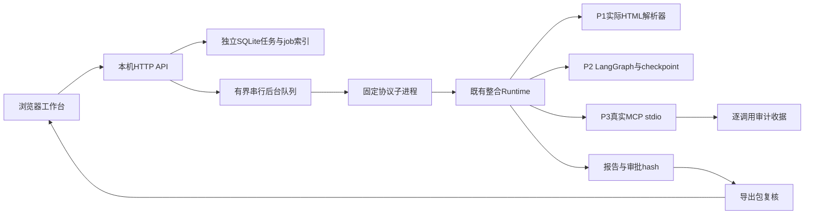

# 技术架构与数据设计 v1

## 模块与复用契约

`server.py`只负责HTTP合同、静态资源和会话边界；`service.py`处理任务/后台job及可替换Engine接口；`store.py`管理SQLite索引；`engine.py`固定子进程命令与环境；`engine_worker.py`转换既有Runtime为UI结果；`web/`只消费API，避免读取本机目录。替换引擎实现create/operate/export/catalog四个操作后，UI和任务索引可继续复用；不能仅换一个模型名字就认为获得真实调用授权。

UI状态是图状态的投影。图中的request_hash/report_hash与checkpoint决定批准是否有效；SQLite索引只提供列表、job状态和应用审计，不替代工作流事实。每个task拥有独立目录，内部只有一个run；不能让客户端指定解释器、根路径、工具名、环境变量或预算。

## 数据实体

`tasks`：id、title、question、status、state_json、archived、busy、last_error、created_at、updated_at；run_id嵌入state_json。`jobs`：request_id主键、task_id、action、payload_hash、status、error、created_at、updated_at。`events`：自增id、task_id、request_id、kind、details_json、created_at。任务和job预留在同一SQLite事务内，避免重复请求或多次点击生成多个run。decision_outcome由原工作流错误码派生，区分人工拒绝与技术失败，不改原图状态。

run目录内复用原checkpoint、0成本脚本账本、notes、approvals、tool-events、mcp-audit及artifacts。下载时复核实际收据与完成状态，在临时目录构建原v1导出包并通过verify_bundle，再生成ZIP。文件名来自固定清单，ZIP不含数据库、配置、环境或主机路径。

## 故障恢复

同一应用状态目录由OS文件锁独占。单后台worker防止同一服务的并发状态覆盖；单任务busy拒绝并行决定，既有Runtime锁提供第二层保护。启动发现未完成job时标记interrupted，不自动批准或重放副作用。操作者显式恢复：检查该task唯一run并调用Runtime.recover，依旧停留于人工门。已产生制品的完成run可重复恢复而不增加模型调用。

create在写run与回写索引之间崩溃时，通过task目录唯一run发现已完成创建；未形成有效run时显示稳定失败，保留诊断并允许另建任务，不自动删除半成品。超时终止只针对自己启动的worker进程树。当前保证为被测本机边界，不是通用分布式exactly-once。

## G2-A新增范围层

ResearchProjects通过应用Store新增project/scope/event表；与Library共用本应用事务。范围hash绑定问题、约束和版本manifest。只读检索与证据校验不调用Engine；原P1/P2/P3不变。合同见graduation/G2-PROJECT-CONTRACT.md，验收见graduation/G2A-ACCEPTANCE.md。
