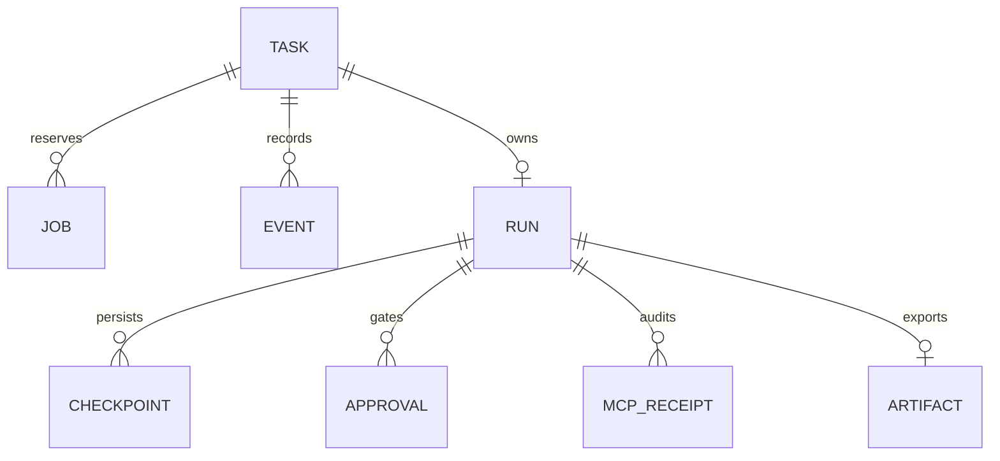
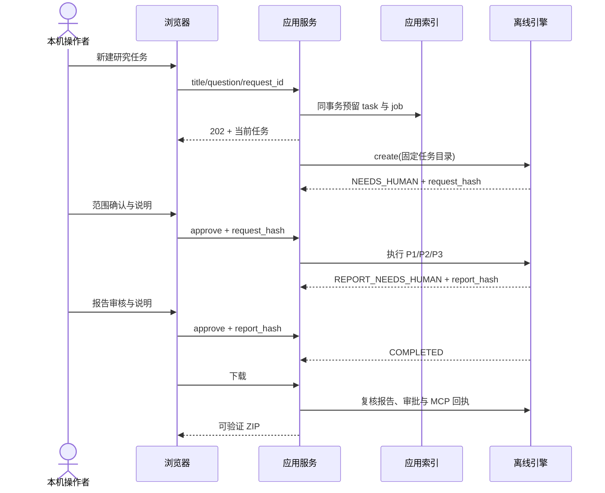

# 课设复用、数据关系与扩展计划

建议题目：**基于可追溯证据与人工审批的 AI 研究交付系统设计与实现**。产品名“研据工作台”可保留，课程题目以老师要求为准。

## 数据关系

TASK/JOB/EVENT 在应用 SQLite；RUN 及其图数据保留在该任务的独立目录。`run_id` 实际存于 `tasks.state_json`，不是独立列。`task_id` 关联网页操作；`request_id` 关联一次应用决定；`run_id` 关联图与工具；`request_hash/report_hash` 绑定审批版本；MCP call ID 与正文哈希绑定证据。ZIP 沿用原 v1 合同，应用表不是 ZIP 的一部分。

## 确定性代码与模型分工

模型仅生成计划、证据判断和草稿；本版实际为受限脚本模型。输入校验、路径、权限、预算、允许工具、审批版本、重试、checkpoint、幂等、证据绑定和交付复核必须由确定性代码控制。真实模型不能通过文本“已经批准”改变审批状态。

## 适配接口

`Engine.call(operation, task_root, payload) -> dict`，见 `engine.py`。四个操作为 create、operate、catalog、export。运行结果为 `state`，至少包含原工作流状态和审批哈希；export 返回 ZIP 与原复核器结果。实现新 Engine 时必须保留这些语义，先通过本应用合同与恢复测试，再扩展 UI metadata。HTTP 客户端不能提交 Python 路径、命令、provider 或预算参数。

现有适配器固定候选与维度，不能仅编辑网页选项就变成通用研究引擎。正式资料接入需新资料合同、授权范围、来源/许可证/快照和回归评估；P1 服务接入需先确认 API 版本与超时，不操作现有数据库来迁就演示。P2 模型内容不足需要独立评估，不能改 gold 或历史失败。本版只读复用三个模块，未改变原业务代码。

## 与常见课设材料对应

| 材料 | 当前证据 | 后续由老师要求决定 |
|---|---|---|
| 需求与用例 | PRD F01–F10、浏览器完整流程 | 用户访谈、指定用例格式 |
| 架构/数据库 | 分层图、ERD、SQLite 实体与事务 | 是否强制 MySQL/Java/Vue 等 |
| 前后端接口 | 原生 Web + 严格 JSON API | 指定框架、接口模板 |
| 测试与质量 | 单元/HTTP/真实 MCP E2E/浏览器 | 指定覆盖率、性能和用户测试 |
| 部署与演示 | Windows 本机启动与固定离线问题 | 校内服务器、容器或公网要求 |
| 论文/答辩 | 决策、失败、LLH_Study、演示步骤 | 页数、模板、查重与引用标准 |

下一阶段顺序：确认评分表；将每项映射到已有证据；只补缺口；确定性控制优先；真实资料/模型/外部部署最后集中授权。不能提前称“只等交作业”，学生仍需独立讲解和学校要求适配。
