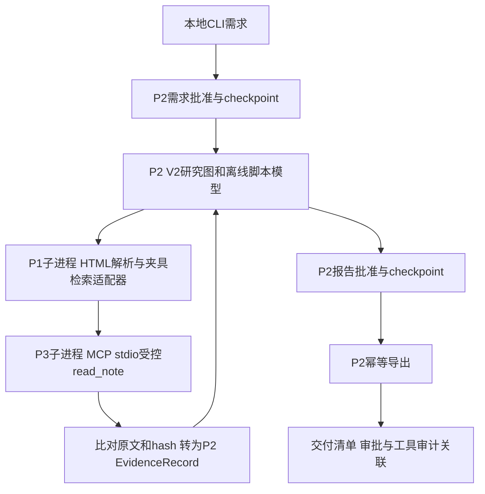

# 整合架构与数据流

协调层位于 `integrations/graduation/`，使用P2项目本地Python运行真实LangGraph；P1/P3各通过其本地.venv子进程执行适配器。无新依赖、无跨项目包安装，P1/P2业务文件零修改。解释器和脚本路径由代码固定，不取模型参数。

P1适配器只读整合原创HTML，使用 `PythonDocsHtmlParser` 返回章节/正文/block位置；关键词匹配明确标注 `fixture-keyword`，不调用P1正式工厂/BGE/Qdrant。来源保留原HTMLhash、section_anchor和段落位置，URI用example.invalid且不访问。

每个P1章节映射到整合运行目录内程序命名的md文件，P3启动通过句柄层校验。P2 SourceStore适配器按实际查询取得P1命中，再通过MCP读取对应note_id，比对text/content_sha256与批准快照；不把缓存的固定答案直接当工具执行。P2 EvidenceRecord正文及hash与P1/P3一致。

状态目录仅限新建整合运行：checkpoint、离线operation ledger、批准事件、P3审计、报告制品。离线ledger上限0分，不构造真实模型/总额账本；它不是新增P2付费容量。运行ID由代码UUID产生。资料hash变化、输入成员漂移、审批hash不匹配均拒绝恢复。

模型只负责P2已允许的计划与草稿提案；确定性代码负责检索参数、候选过滤、工具名单、路径、证据绑定、次数、费用、审批与导出。脚本模型是演示替身，不约束未来生产模型只能输出固定答案。
# C4：导出后独立复核边界（2026-09-17）

新增verify_bundle.py仅依赖Python标准库，不导入workflow_runtime或P1/P2/P3，不读取环境文件。只读取固定的delivery.json、result.json、report.md、delivery-report.md及严格32位call_id推导的mcp-audit收据；artifact_name只验证格式，从不作为文件读取路径。拒绝重复JSON键、非有限数、符号链接/reparse点、非普通文件、未知目录成员及超过边界的文件/事件数量。目录由可信本机用户持有；不承诺抵御同一OS用户在检查与读取间进行并发路径替换。

先验证外部可选delivery哈希，再验证严格v1清单、报告字节、两门approve记录的自哈希与run/expected_hash、所有begin/end收据自哈希、成对调用参数及snapshot/result关联和计数。退出码0表示本包内部一致，1表示校验失败，2表示CLI参数错误。无外部哈希时明确unanchored；有匹配哈希也只证明匹配操作者提供的锚，不证明锚来自可信第三方。

现有导出包未携带原始请求对象、结构化报告对象、MCP完整响应、checkpoint或原资料副本，因此无法重新计算request_hash/report_hash/result_hash或独立重建P1语义链；只能校验这些值的格式与关联，以及实际保存文件的哈希。不得把这种复核称为重新执行工作流、身份认证、独立内容评价或不可篡改签名。保留旧导出合同，避免重写历史演示来弥补上述范围。
