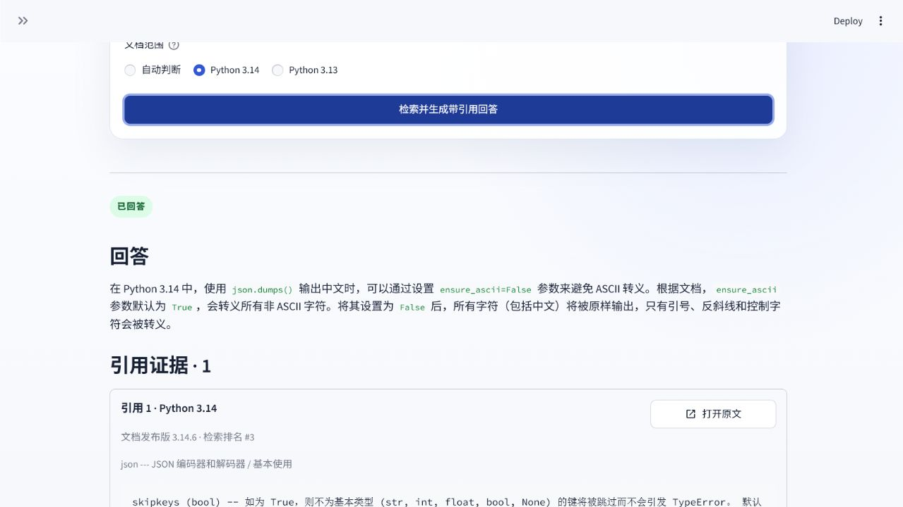
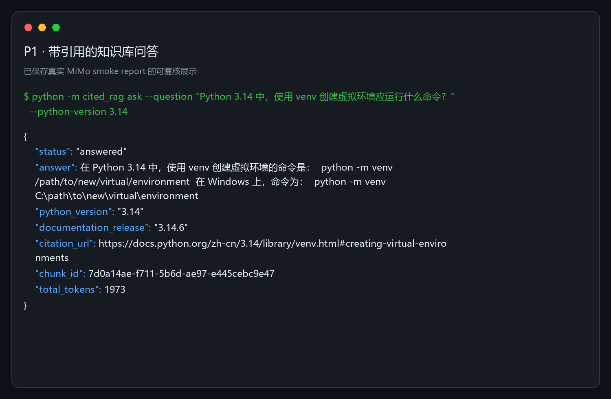

# P1：带引用的知识库问答

本地导入 Python 官方简体中文文档，使用固定 BGE 模型与 Qdrant 检索，再由 MiMo 只根据检索证据生成回答。引用元数据由程序绑定；证据不足时拒答。

目标用户是需要查阅 Python 3.13/3.14 官方简体中文文档的学习者和开发者。输入为问题及可选版本；输出为 JSON 回答、官方引用、章节、摘录和运行追踪 ID。不处理任意网页、私有文件、第三方库、写操作、工具执行或开放式联网搜索。

## 当前能力

- Python 3.14 文档子集，少量 Python 3.13 对照。
- 官方 HTML 清洗、可追踪 Chunk、固定本地向量索引。
- 生产检索使用Dense exact、中文/代码Sparse、同分边界闭合与客户端精确RRF。
- `mimo-v2.5` 结构化回答、拒答和真实引用。
- 本地 JSON CLI、Streamlit 求职展示页与只读 FastAPI；FastAPI已有固定Linux容器入口。
- Qdrant Local 离线适配器，以及 Docker Qdrant Server、读写密钥隔离、持久化、快照恢复和API重启零漂移验收。
- V2-C2.1全新20题发布集达到Recall@5 95%、candidate Recall@20 100%，门禁通过并激活Hybrid build；旧失败实现与Dense回滚build均保留。
- V2-D1已加入隐私安全JSON日志、手工OpenTelemetry trace/metrics和本地Collector；384项离线测试通过，运行态已激活并完成故障隔离与回滚验证。
- V2-D2最小权限GitHub Actions已在公开仓库通过：Windows离线合同与Linux API镜像合同均为`success`，run `33173695996`。
- V2-D3有限重试已实现：最多两次物理尝试、固定瞬态错误白名单、退避/总时限、费用不确定语义、物理调用观测和离线fake验收；独立镜像运行验收通过，活动`v2-d1`未切流量。
- P1-F / V2-E2B静态证据页已发布到 <https://rorinhoon-bot.github.io/ai-application-portfolio/>；它显著标注录制证据，不连接实时后端。Cloud Run + Qdrant Cloud仅作条件候选。

## GitHub 展示与演示

- **真实证据**：同一V3新20题Dense `Recall@5=75%`、确定性Hybrid `95%`、candidate `Recall@20=100%`；引用绑定 `100%`；锁定回答集拒答准确率 `100%`；人工忠实度 `4/4`。
- **演示入口**：下文提供 CLI 和 Streamlit 启动命令；引用必须来自程序绑定的固定官方文档元数据。
- **公开证据页**：<https://rorinhoon-bot.github.io/ai-application-portfolio/>；仅静态录制证据，不接受任意问题。
- **面试学习**：项目数据流、引用绑定、评估解释和追问见 [LLH_Study.md](LLH_Study.md)。
- **截图状态**：已提交两张真实截图：Streamlit 引用回答与 CLI 结果，见下方“演示”区；截图来自本地运行，不代表在线服务。

> 公开说明边界：语料、模型和 Qdrant 运行数据不进入 Git；新机器须按下文恢复。真实问答需要使用者自己的 API Key，绝不提交 `.env` 或 `.env.qdrant-*`。

## 架构

`CLI / Streamlit / FastAPI（宿主机或只读容器）→ CitedRagService → 本地 BGE + Sparse → Qdrant Local（测试/回退）或Compose Server → 客户端RRF → MiMo选择Chunk ID → 程序绑定真实引用`

完整设计见 `docs/ARCHITECTURE.md`。

## 本地运行

### 新环境准备

需要 CPython 3.14：

```powershell
py -3.14 -m venv .venv
.\.venv\Scripts\python.exe -m pip install -r requirements-dev.txt
```

恢复固定语料快照，不访问网络：

```powershell
$env:PYTHONPATH="src"
.\.venv\Scripts\python.exe scripts\restore_corpus_snapshot.py
```

恢复固定 BGE 模型需要访问 Hugging Face；脚本只接受已记录仓库、完整revision、5文件allowlist、大小和SHA-256：

```powershell
.\.venv\Scripts\python.exe scripts\fetch_embedding_model.py --restore
```

离线重建本地Qdrant索引：

```powershell
.\.venv\Scripts\python.exe scripts\build_local_index.py --restore
```

恢复命令保留Git中的历史评估报告，不覆盖其时间、build ID或指标。

### Qdrant Server（V2-B1）

前提：Docker Desktop 已启动；固定语料和 BGE 模型已按上文恢复。首次生成三份角色分离配置；脚本拒绝覆盖已有文件，也不打印密钥：

```powershell
.\.venv\Scripts\python.exe scripts\configure_qdrant_runtime.py
```

启动固定摘要的 Qdrant 1.19.0。Compose 只发布 `127.0.0.1:6333`，不发布 6334/6335：

```powershell
docker compose `
  --env-file .env.qdrant-server `
  -f deploy\compose.qdrant.yaml `
  up -d qdrant

Invoke-RestMethod http://127.0.0.1:6333/readyz
```

从固定本地资产离线重建 Server 索引。`--restore` 表示保留仓库中的历史验收报告，不会覆盖其字节：

```powershell
.\.venv\Scripts\python.exe scripts\build_server_index.py --restore
.\.venv\Scripts\python.exe scripts\validate_qdrant_permissions.py --restore
```

完整运维验收会执行 `restart`、不带 `-v` 的 `down/up`，并创建、下载、上传恢复一个 snapshot；恢复验证后只删除唯一临时 collection：

```powershell
.\.venv\Scripts\python.exe scripts\validate_qdrant_persistence.py --restore
.\.venv\Scripts\python.exe scripts\validate_qdrant_recovery.py --restore
```

停止服务可使用下面命令。禁止运行 `docker compose down -v`，否则会删除命名卷：

```powershell
docker compose `
  --env-file .env.qdrant-server `
  -f deploy\compose.qdrant.yaml `
  stop qdrant
```

若刚安装 Docker 后终端找不到 `docker`，先关闭并重新打开 PowerShell。详细执行证据见 `docs/QDRANT_SERVER_DESIGN.md` 和 `data/qdrant-*-report.json`。

### API 配置

在本目录创建 `.env`：

```env
MODEL_PROVIDER=mimo
MODEL_API_KEY=replace-with-your-key
MODEL_BASE_URL=https://api.xiaomimimo.com/v1
MODEL_NAME=mimo-v2.5
MODEL_TIMEOUT_SECONDS=30
```

不要提交 `.env`。当前仓库已忽略该文件。

### 问答

```powershell
$env:PYTHONPATH="src"
.\.venv\Scripts\python.exe -m cited_rag ask `
  --question "Python 3.14 使用 json.dumps 输出中文时怎样避免 ASCII 转义？" `
  --python-version "3.14"
```

输出是 JSON。成功和正常拒答退出码为0；稳定错误写入 stderr，退出码为1。

### Streamlit 展示页

最省事：双击仓库根目录的 `start-p1-web-ui.cmd`。脚本会自动使用 P1 的 `.venv`、设置 `PYTHONPATH` 并打开浏览器。

也可手动运行：

```powershell
$env:PYTHONPATH="src"
.\.venv\Scripts\python.exe -m streamlit run streamlit_app.py
```

浏览器打开终端显示的本地地址。页面与 CLI 复用同一个 `CitedRagService`：只在提交问题时初始化模型和索引；引用 URL、版本、章节和摘录仍由程序绑定。侧栏默认收起，可用左上角按钮查看评估指标。

### FastAPI 只读服务

最省事：双击仓库根目录的 `start-p1-api.cmd`。脚本固定使用 V2 `.venv`、`127.0.0.1:8000` 和项目 `src`。

也可手动启动：

```powershell
.\.venv\Scripts\python.exe -m uvicorn cited_rag.api:app `
  --app-dir src `
  --host 127.0.0.1 `
  --port 8000
```

端点：

- `GET /healthz`：只检查进程存活，不初始化 BGE、Qdrant 或 MiMo。
- `GET /readyz`：检查配置、固定模型资产和活动索引；不调用 MiMo。
- `POST /v1/answers`：复用 `CitedRagService`，返回回答与请求 ID。
- `GET /docs`：本地 OpenAPI 页面。

健康检查：

```powershell
Invoke-RestMethod http://127.0.0.1:8000/healthz
Invoke-RestMethod http://127.0.0.1:8000/readyz
```

问答请求：

```powershell
$body = @{
  schema_version = "1"
  question = "Python 3.14 的 json.dumps 如何避免 ASCII 转义？"
  python_version = "3.14"
} | ConvertTo-Json

Invoke-RestMethod `
  -Method Post `
  -Uri http://127.0.0.1:8000/v1/answers `
  -ContentType "application/json" `
  -Body $body
```

`/readyz` 或问答需要先恢复模型、选定 Local/Server 索引并配置 `.env`。存在 `.env.qdrant-read` 时使用 Server read-only key；没有时默认使用 Local。问答会调用 MiMo，可能产生费用；普通测试、`/healthz` 和就绪检查不会调用 MiMo。API 默认仅绑定回环地址并关闭 CORS；未实现公网认证、限流或配额，不得直接暴露到互联网。

### FastAPI Linux容器（已验收运行基线 v2-c2-1）

前提：已按上文恢复固定模型，且V2-B1 Qdrant容器正在运行。API镜像不会包含 `.env`、模型或索引；运行时把模型和Server Manifest只读挂载。

在本项目目录执行：

```powershell
$env:P1_MODEL_ENV_FILE=(Resolve-Path .env).Path

docker compose `
  --env-file .env.qdrant-server `
  -f deploy/compose.qdrant.yaml `
  build api

docker compose `
  --env-file .env.qdrant-server `
  -f deploy/compose.qdrant.yaml `
  --profile api `
  up -d --no-deps api
```

验证：

```powershell
Invoke-RestMethod http://127.0.0.1:8000/healthz
Invoke-RestMethod http://127.0.0.1:8000/readyz
docker inspect cited-rag-qdrant-api-1 --format '{{.State.Health.Status}}'
```

只停止无状态API，不删除Qdrant volume：

```powershell
docker compose `
  --env-file .env.qdrant-server `
  -f deploy/compose.qdrant.yaml `
  --profile api `
  stop api
```

已验收基线固定44个wheel哈希，标签为`cited-rag-api:v2-c2-1`。D1配置已升级为51个wheel哈希，运行标签为`cited-rag-api:v2-d1`。容器使用UID/GID `10001:10001`、只读rootfs、只读资产挂载、单worker与资源上限。基础容器验收见`data/api-container-report.json`，D1运行证据见`data/observability-runtime-release-report.json`。禁止使用`docker compose down -v`。

### V2-D1本地可观测性（运行已激活）

API默认关闭OTLP导出；JSON业务日志仍使用固定allowlist。运行验证时需显式设置：

```powershell
$env:P1_MODEL_ENV_FILE=(Resolve-Path .env).Path
$env:P1_OTEL_ENABLED="true"

docker compose `
  --env-file .env.qdrant-server `
  -f deploy/compose.qdrant.yaml `
  --profile observability `
  up -d otel-collector
```

Collector只把Prometheus exporter发布到`127.0.0.1:9464`；OTLP `4318`仅在Compose网络中使用。它不参与API readiness。当前运行态已按批准激活；完整运行证据见`data/observability-runtime-release-report.json`。

### V2-D2本地 CI

`.github/workflows/p1-ci.yml`包含Windows离线测试合同与Ubuntu API镜像合同。workflow使用官方Action完整commit SHA、`contents: read`和`persist-credentials: false`，不读取repository secret，不启动Qdrant、不push镜像。固定fake smoke命令：

```powershell
.\.venv\Scripts\python.exe scripts\run_ci_smoke.py
```

本地机器结果见`data/ci-smoke-report.json`；远程公开运行见 <https://github.com/rorinhoon-bot/ai-application-portfolio/actions/runs/33173695996>，Windows与Linuxjob均为`success`。

### V2-D3有限重试

实现与边界见`docs/RETRY_DESIGN.md`。一次逻辑请求最多两次物理尝试，只重试固定HTTP/连接阶段白名单；读取/写入超时、非法模型输出和引用错误不重试。默认等待250毫秒，`Retry-After`和等待均不超过2秒，总预算不超过单次超时加2秒。

离线重试smoke：

```powershell
.\.venv\Scripts\python.exe scripts\run_retry_smoke.py
```

机器结果见`data/retry-smoke-report.json`。独立`cited-rag-api:v2-d3`运行与回滚边界证据见`data/retry-runtime-release-report.json`；验收没有发送真实问题或调用MiMo。

### P1-F / V2-E受限部署设计

首发选择GitHub Pages纯静态证据页：只展示可追溯的固定指标、录制问答、失败案例、架构与运行证据，并显著标注“非实时推理”。页面不接受任意问题，不连接FastAPI、Qdrant或MiMo，不持有密钥。

制品位于`../../portfolio-site/p1/`。标准库导出器固定读取12份机器报告和2张已追踪截图，生成规范数据、同源JS、图片副本与输入/输出SHA-256清单：

```powershell
.\.venv\Scripts\python.exe scripts\export_portfolio_evidence.py --check
.\.venv\Scripts\python.exe -m http.server 8765 --bind 127.0.0.1 --directory ..\..\portfolio-site\p1
```

浏览器打开`http://127.0.0.1:8765/`。这只是本地录制证据预览，不是在线AI服务。

Cloud Run + Qdrant Cloud只保留为后续受控实时演示候选；资源实测、独立身份、跨重启持久配额、费用断路器、Secret和snapshot恢复未通过前不公开。设计见`docs/RESTRICTED_DEPLOYMENT_DESIGN.md`。GitHub Pages只公开静态录制证据，不代表实时服务已部署。

Pages发布设计见`docs/PAGES_RELEASE_DESIGN.md`。E2B经批准完成：PR #1 squash合并，Pages Source为GitHub Actions，首次deployment `6141599225`成功；根页面、CSS、JS、JSON与两张图片均返回200且SHA-256匹配本地制品。机器证据见`data/pages-public-release-report.json`。

## 测试

```powershell
.\.venv\Scripts\python.exe -m pytest -q
```

普通测试不访问网络，不调用 MiMo，不下载模型。

本次发布证据回填后的准确测试数以最新CI为准；Windows测试环境若不能创建symlink，只跳过攻击夹具，校验器的拒绝分支未放宽。V1/V2-A/V2-B1/B2测试零删除；普通测试不要求Docker。运行证据见`data/observability-runtime-release-report.json`、`data/retry-runtime-release-report.json`、`data/pages-release-readiness-report.json`和`data/pages-public-release-report.json`。

## 评估结果

V2-C1报告已提交且默认不可覆盖。Qdrant Server运行时，可把复验写到新的项目内JSON路径：

```powershell
.\.venv\Scripts\python.exe scripts\evaluate_retrieval_v2.py `
  --mode dense `
  --output data/retrieval-v2-dense-rerun.json

.\.venv\Scripts\python.exe scripts\evaluate_retrieval_v2.py `
  --mode dense-plus-identifiers `
  --output data/retrieval-v2-dense-plus-identifiers-rerun.json
```

每个模式执行5次warm-up和150次计时查询；只使用read-only Qdrant，不调用MiMo。输出路径必须在项目内、父目录已存在且文件尚不存在。

- 检索 `Recall@5`：86.7%。
- V2-C1 50题 Dense：Recall@5 84.0%、MRR@5 0.6313、nDCG@5 0.6840、P95 5.304秒。
- V2-C1 50题当前生产路径：Recall@5 90.0%、MRR@5 0.7217、nDCG@5 0.7673、P95 5.802秒。
- V2-C2.1新20题 Dense：Recall@5 75.0%、MRR@5 0.4867、nDCG@5 0.5514、P95 8.604秒。
- V2-C2.1新20题旧生产路径：Recall@5 80.0%、MRR@5 0.6125、nDCG@5 0.6608、P95 8.113秒。
- V2-C2.1新20题当前Hybrid：Recall@5 95.0%、MRR@5 0.7100、nDCG@5 0.7705、candidate Recall@20 100%、P95 8.011秒。
- V2-C2.1旧50题仅做50/50三次稳定性回归，不把旧质量标签用于发布；新20题在查询前冻结，与V2问题和相关Chunk均无重复。
- V2-C2 Hybrid development：Recall@5与candidate Recall@20均为96.67%，P95 8.309秒。
- V2-C2 locked：唯一一次运行在生成指标前触发重复排名漂移；发布门`passed=false`，未激活、未重启API，不报告不存在的锁定质量指标。
- 最终回答集：可回答召回80%，拒答准确率100%。
- 引用绑定有效率100%。
- 人工忠实度4/4。
- 双版本比较人工复核3/3；原0/3检索失败报告保留。

详见：

- `docs/RETRIEVAL_EVALUATION.md`
- `docs/RETRIEVAL_V2_EVALUATION.md`
- `data/hybrid-release-gate.json`
- `docs/EVIDENCE_CALIBRATION.md`
- `docs/ANSWERING_EVALUATION.md`

## 演示





五分钟讲解见 `docs/DEMO.md`；项目原理、核心代码、取舍、面试题和自测题见 `LLH_Study.md`。

## 已知限制

- Git保存580,230字节压缩HTML快照；恢复后的原始HTML仍被忽略。
- 95 MB模型资产和 Qdrant 数据不进入Git，需要按上方命令恢复。本次 Server 实测 storage 为205,628,422 bytes，snapshot volume为19,845,184 bytes。
- CLI 和 Streamlit 都不开放索引写入；索引构建仍使用受控脚本。
- 锁定回答集仅10题。
- 双版本比较人工集只有3题；机器可读 `conflict` 状态尚未形成稳定真实基线。
- 只对固定HTTP状态和连接阶段故障自动重试一次；读取/写入阶段异常直接失败。真实供应商故障序列、实际重试费用与大并发退避效果尚无线上证据。
- V2-B2 API容器仍是单机回环形态；没有公网认证、TLS、限流、弹性扩容或高可用证据。
- Qdrant 的 API Key 通过本机回环 HTTP 传输；没有 TLS，因此不得改成局域网或公网监听。
- FastAPI 当前只读且仅适合本地回环访问；D1只有本地短期遥测，无持久化、告警或云后端，公网认证、限流、配额和部署仍属于后续 V2 阶段。
- GitHub Pages只发布静态录制证据；不得描述为实时AI服务、生产后端或公网高可用证明。
