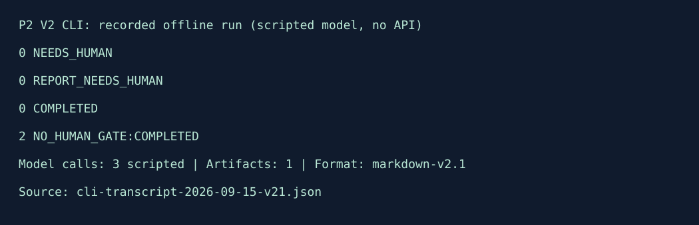

# P2：LangGraph 研究报告工作流

> **公开版本（2026-09-17）**：V2最终工程回归266项通过；真实内容验收仍未通过，独立人工评分未完成。最终入口为[20-FINAL-ACCEPTANCE-AUDIT.md](docs/v2/20-FINAL-ACCEPTANCE-AUDIT.md)。以下227/248/259项及4.8/5等数字均属于标明版本的历史记录，不是当前V2内容质量结论。

> **2026-09-16 验证收尾**：工程交付及两批真实验证已结束；完整套件历史记录259项通过，预算/图/CLI定向76项通过；第一批六题2份有限批准、4份拒绝，修复后新三题2份有限批准、1份拒绝。内容验收未通过，P2升级整体尚不能标完成。累计预算仍限5元；有效保守占用4.17元，调用容量109/109已用尽，不发新真实请求。详见[完整结论](docs/v2/18-VALIDATION-CLOSEOUT.md)、[修复审计](docs/v2/19-CONTENT-ACCEPTANCE-REPAIR.md)、[新三题证据](evals/results/v2-content-completion-verification-20260916.json)与[完整六题证据](evals/results/v2-final-regression-complete-20260916.json)。[真实样例](demo/v2/live-conditional-report-20260915.md)需结合[助手复核备注](evals/results/v2-d5k-assistant-approval.json)阅读，不代表整批质量通过。

> 历史记录（2026-09-14）：P2 V2 已完成受控真实模型闭环和 12 题批次。** [设计入口](docs/v2/README.md)和[开发交接](docs/v2/06-DEVELOPMENT-HANDOFF.md)记录现状审查、PRD、架构、评估、实施计划和可运行入口。V2 已有严格合同、调用账本、两个人工门、checkpoint 恢复、UNKNOWN 停止、离线 CLI、官方固定资料和幂等 Markdown 导出；真实闭环、失败样本与限制见 [live 记录](evals/results/v2-live-followup-2026-09-14.md)。12 题的[助手单人复核](evals/results/v2-content-assistant-review-2026-09-14.md)发现 1 个影响推荐的范围错误，内容验收未通过。这不代表云部署或生产可用。以下正文同时保留 V1 基线，`report-v2.md` 和 4.8/5 是 V1 合成演示报告，不是 V2 质量结果。

作品集旗舰项目。

## 解决什么问题

当团队需要在多个 AI 应用技术方案之间做选择时，资料分散、比较口径不一致、结论缺少证据，人工研究又难以复现。本项目把“确认需求—规划—检索—写作—审校—人工确认—安全导出”做成可暂停、可恢复、可评估的显式工作流。

首版场景：**AI 应用技术选型研究报告**。例如，输入“为中文技术文档问答选择工作流框架，比较 2～4 个候选方案，并考虑成本、可观测性和 Human-in-the-loop”，输出带证据、限制和建议的 Markdown 报告。

## 用户、输入、输出与边界

- 目标用户：需要比较 AI 应用技术方案的工程师、技术负责人和产品负责人。
- 输入：研究问题、报告读者、业务约束、2～4 个候选方案、3～8 个评价维度及固定来源策略。候选或评价维度缺失时暂停等待人工，不自行猜测。
- 输出：人工批准后的内容寻址 Markdown 报告，以及可机器校验的运行摘要。
- 不处理：真实或实时技术选型、任意网页搜索、代码/依赖/云资源修改、高风险医疗/法律/金融研究、公开部署。

## 与普通聊天机器人、普通 RAG 的区别

- 普通聊天机器人通常直接生成一段回答；本项目保存显式状态，按节点执行，有条件路由、重试上限、停止条件和人工暂停。
- 普通 RAG 通常是“检索一次，再回答一次”；本项目会先确认需求和研究计划，再多轮检索、检查证据是否充足、写作、审校和修改。
- 模型不能直接执行任意工具、访问任意 URL、决定输出路径或完成最终导出。程序校验 Tool Calling 参数；人工批准后才产生最终报告文件。

## 工作流概览


## GitHub 展示与演示

- **V1 基线证据**：`144 passed`；固定工作流案例 `12/12`；引用绑定 `10/10`；checkpoint 恢复 `1/1`。V2 当前离线回归为 `227 passed`，不包含真实内容质量分数。
- **已有制品**：本 README 已嵌入工作流 SVG；下方“离线演示”嵌入真实终端 SVG。
- **V2 演示**：离线双门、真实闭环证据、失败样本与预算恢复边界见 [docs/v2/11-DEMO.md](docs/v2/11-DEMO.md)。
- **D5 评估**：`scripts/run_v2_content_evaluation.py` 已运行冻结 12 题并统计流程与引用身份；助手单人复核发现范围错误，内容验收未通过，不能用结构指标代替独立人工 rubric。
- **面试学习**：状态图、人工暂停、恢复、幂等导出和面试问答见 [LLH_Study.md](LLH_Study.md)。
- **演示材料**：本README及V2演示目录提供实际运行摘要和可复现命令。

> 公开说明边界：离线演示的资料和工具仍是原创虚构/确定性夹具；D2 官方快照已用于受控 live 研究，但不能单独作为真实技术选型结论或真实模型质量证明。

## 当前阶段

- V2 D1 合同、D2 官方资料快照、D3 离线 MVP 与一份 D3-live 真实闭环已完成；V2 实现入口为 `src/agent_research/v2/`，CLI 为 `scripts/run_research_v2.py`。
- V2 离线流程：`start` → 需求/预算人工批准 → 受控检索与报告草稿 → 报告人工批准 → 内容寻址导出。默认使用 `demo/v2/` 合成夹具和脚本模型；D2 真实快照已独立采集，并已完成受控 D5 批次。
- D2 快照位于 `data/real-sources/snapshot-1855a50c906058faffe87039/`，6 个固定 commit 文件共 `163080` bytes；D3-live 真实闭环、合同失败样本和审校返修样本见 [live 记录](evals/results/v2-live-followup-2026-09-14.md)。
- D5 批次的助手单人量表为 `3.4/5`，且有 1 个严重范围错误；修复后开发题回归 1/1 不再复现，并新增审校前范围断言门以阻止已知整快照缺证据表述自动继续，但这不是独立人工验收，内容质量仍未通过。
- P1 的历史工作满足项目启动背景；不据此声称 P1 完整云部署已完成。
- P2 独立 `.venv`、固定依赖、PRD 和架构基线已完成。
- 10 份原创资料、40 个稳定证据章节、12 个固定案例和金标准已冻结；D2 另有 6 个固定 commit 官方原文快照，覆盖审查见 [09-SOURCE-COVERAGE.md](docs/v2/09-SOURCE-COVERAGE.md)。
- 显式 LangGraph 已覆盖需求确认、只读工具、两轮证据门、结构化写作、有限审校、最终人工确认和幂等 Markdown 导出。
- 两个人工暂停点、SQLite 恢复、revision/hash 绑定、有限重试和不可覆盖导出均有离线测试。
- 统一 `workflow-v1` 运行器实际执行全部 12 个案例；金标准未因结果修改。
- 可选运行时 observer 已覆盖完整图；生成 `node-event-v1` 和内容哈希绑定的 `run-summary-v1`，不进入 checkpoint。
- `offline-demo-v1` 用三个固定案例展示需求暂停、成功导出和证据不足停止，并关联确定性运行摘要。
- 当前量化基线：案例通过 `12/12`，路径 `12/12`，引用绑定 `10/10`，重试/停止 `12/12`，checkpoint 恢复 `1/1`，无证据声明 `0/10`，未批准导出与权限扩大均为 `0`。
- V1 历史普通测试：`144 passed`；测试默认阻断网络。V2 当前全量回归：`227 passed`。
- V1 合成报告历史人工质量评分：`4.8/5`，不作为 V2 质量结果；记录见 `evals/results/workflow-v2-human-report-review.md`。
- 需求见 `docs/PRD.md`，状态图和安全边界见 `docs/ARCHITECTURE.md`。
- 精确依赖提案见 `docs/DEPENDENCIES.md`；首批原创离线评估资料见 `docs/EVALUATION_DATA.md`。

V2 离线演示仍使用原创合成夹具、确定性假工具和假写作者；D2 官方快照已用于受控 live 研究，费用记录与保守预留见 D5 结果。没有云部署或公开发布。



图来自 [真实CLI执行记录](demo/v2/cli-transcript-2026-09-15-v21.json)，不是终端截图或真实模型质量证明。

## V2 CLI 离线最小闭环

在 P2 目录执行，默认只使用 `demo/v2/` 合成夹具，不访问网络：

```powershell
.\.venv\Scripts\python.exe scripts\run_research_v2.py start
# 复制输出中的 thread_id，分别执行两次人工批准
.\.venv\Scripts\python.exe scripts\run_research_v2.py resume --thread-id <thread_id> --action approve
.\.venv\Scripts\python.exe scripts\run_research_v2.py resume --thread-id <thread_id> --action approve
```

可用 `status` 查看 checkpoint，`cancel` 取消当前人工门，`recover --thread-id <thread_id>` 续跑进程退出后的未完成节点；recover不替代人工批准，未知请求不重发，详见 [进程恢复实测](docs/v2/14-PROCESS-RECOVERY.md)；`--runtime-root` 指定本地运行目录。`--mode live` 只选择 DeepSeek 适配器，仍需 `DEEPSEEK_API_KEY`、预算 JSON 和人工批准，不能把离线夹具结果当成真实模型验证。

`--mode live model-config` 只打印非秘密模型配置 hash，不访问网络；真实请求的 `model_config_hash` 必须与它一致。`--mode live live-preflight --price-card-file <card.json>` 只检查 key/价格卡而不联网。live CLI 使用 `deepseek-flash`；会读取 P2 根目录可选 `.env`，复制 `.env.example` 为 `.env` 后填写 `DEEPSEEK_API_KEY`，现有 PowerShell 环境变量优先。实际 live 还必须有价格卡、批次预算及固定共享总账本；当前剩余仅3分可预留，暂停新增调用。

## 新环境安装

要求：Windows、CPython `3.14.x`。在仓库根目录打开 PowerShell：

```powershell
Set-Location projects\02-agent-research-workflow
& 'C:\Path\To\Python314\python.exe' --version
& 'C:\Path\To\Python314\python.exe' -m venv .venv
.\.venv\Scripts\python.exe -m pip install --only-binary=:all: -r requirements-dev.txt
.\.venv\Scripts\python.exe -m pip check
```

把示例 Python 路径替换为本机 CPython 3.14 可执行文件。`requirements-dev.txt` 已固定生产、传递和测试依赖版本。当前离线演示不需要 API Key；所需环境变量完整列在 `.env.example`，运行命令会显式设置它们。

## 离线演示


运行暂停、成功、失败和观测四段终端简报：

```powershell
$env:LANGGRAPH_STRICT_MSGPACK="true"
$env:LANGSMITH_TRACING="false"
.\.venv\Scripts\python.exe scripts\run_demo.py
```

使用 `--json` 输出机器可读 manifest；使用 `--check` 重跑真实图并逐字节检查提交的 manifest、Markdown 报告与运行摘要。脚本不接受任意案例 ID 或输出路径。完整说明与提交制品见 `demo/README.md`。

逐字节重建并检查两张 SVG：

```powershell
.\.venv\Scripts\python.exe scripts\check_demo_assets.py --check
```

五分钟讲解提纲见 `demo/FIVE_MINUTE_TALK.md`。

## 离线验证

在 P2 目录执行：

离线验证只使用已有项目环境。运行前设置以下非秘密开关，不需要读取`.env`：

```powershell
$env:LANGGRAPH_STRICT_MSGPACK="true"
$env:LANGSMITH_TRACING="false"
.\.venv\Scripts\python.exe -m pytest -q
```

重新执行 12 个固定案例并检查是否与提交基线完全一致：

```powershell
$env:LANGGRAPH_STRICT_MSGPACK="true"
$env:LANGSMITH_TRACING="false"
.\.venv\Scripts\python.exe scripts\run_workflow_evaluation.py --check
```

去掉 `--check` 会把新运行结果打印为 JSON，但不会修改基线文件。提交基线位于 `evals/results/workflow-v1-baseline.json`。

重新生成一个成功案例的确定性运行摘要：

```powershell
$env:LANGGRAPH_STRICT_MSGPACK="true"
$env:LANGSMITH_TRACING="false"
.\.venv\Scripts\python.exe scripts\run_observability_demo.py --check
```

去掉 `--check` 会把 `run-summary-v1` 打印到标准输出。提交样例位于 `evals/results/privacy-durable-run-summary.json`。

## 当前限制

- 基线证明确定性工作流可靠性，不证明真实模型的语义质量。
- 离线报告内容只来自原创虚构快照；D2 官方快照的章节覆盖审查不等于现实技术选型结论。
- 当前摘要记录节点主动执行耗时，不包含人工等待时间；进程崩溃前未外送的 observer 事件不会由 checkpoint 恢复。
- V1 离线基线没有模型调用，因此其 token、模型调用和已知费用字段均为 `0`；不是 V2 真实模型成本估算。
- 后续真实复测、资料刷新和公开部署仍需单独冻结范围与批准。

## 开发复盘

离线首版的开发过程、失败根因、关键取舍、限制和真实模型接入条件见 [`RETROSPECTIVE.md`](RETROSPECTIVE.md)。V1 已完成最终验收；V2 已完成有限真实模型调用，但内容验收未通过，复测和部署仍需另立关口。

## 学习与面试讲义

30 秒、2 分钟和 5 分钟介绍、核心代码、面试问答、自测题及诚实参与范围见 [`LLH_Study.md`](LLH_Study.md)。P2 已通过最终验收；讲义不代表真实模型或真实资料能力。

## 完成审计

逐项 `PROJECT_STANDARDS.md` 证据见 [`docs/COMPLETION_AUDIT.md`](docs/COMPLETION_AUDIT.md)。真实人工报告质量评分为 `4.8/5`，记录见 [`evals/results/workflow-v2-human-report-review.md`](evals/results/workflow-v2-human-report-review.md)；AI 自评未代替人工验收。
