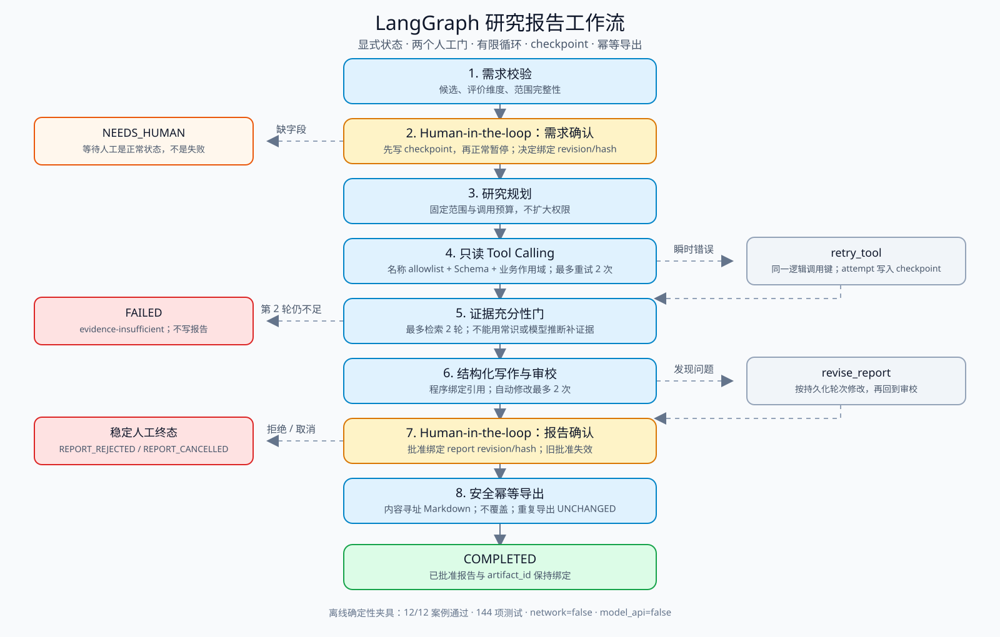
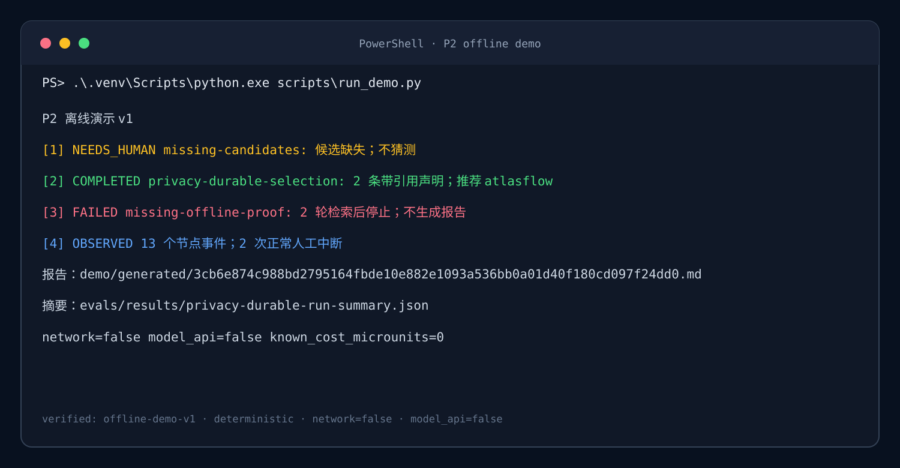

# 离线演示

这个演示用三个冻结案例运行真实 LangGraph，不调用模型，不访问网络：

1. `missing-candidates`：候选缺失，停在 `NEEDS_HUMAN`，系统不猜。
2. `privacy-durable-selection`：需求批准、证据绑定、报告批准、安全导出，最终 `COMPLETED`。
3. `missing-offline-proof`：两轮资料仍不能证明完全离线，稳定 `FAILED`，不生成报告。

同一成功案例还生成 `run-summary-v1`，展示节点事件、两次正常人工中断、工具次数、报告 revision/hash 和制品 ID。

## 工作流概览



## 运行

在 P2 目录执行：

```powershell
$env:LANGGRAPH_STRICT_MSGPACK="true"
$env:LANGSMITH_TRACING="false"
.\.venv\Scripts\python.exe scripts\run_demo.py
```

输出机器可读 manifest：

```powershell
.\.venv\Scripts\python.exe scripts\run_demo.py --json
```

重新运行真实图，并逐字节检查提交的 manifest、Markdown 报告与运行摘要：

```powershell
.\.venv\Scripts\python.exe scripts\run_demo.py --check
```

脚本不接受任意案例 ID 或输出路径。运行中的 checkpoint 和导出先进入系统临时目录；`--check` 只读，不覆盖提交文件。

## 演示截图



截图由 `run_demo.py` 的真实确定性输出生成。逐字节检查：

```powershell
.\.venv\Scripts\python.exe scripts\check_demo_assets.py --check
```

面试演示顺序和讲解内容见 `FIVE_MINUTE_TALK.md`。

## 提交制品

- `generated/offline-demo-v1.json`：暂停、成功、失败三条路径的哈希绑定 manifest。
- `generated/<artifact_id>.md`：最终人工批准后由安全导出器生成的 Markdown 报告。
- `generated/report-v2.md`：根据人工反馈补齐三候选比较、适用条件、下一步、风险和限制的独立评审改写稿；不覆盖 v1 制品。
- `generated/report-v2.md.sha256`：`report-v2.md` 完整文件 SHA-256 校验值。
- `assets/offline-demo-terminal.svg`：从真实终端简报确定性生成的截图。
- `assets/workflow-overview.svg`：两个人工门、有限循环和稳定终态的简化图。
- `../evals/results/privacy-durable-run-summary.json`：成功案例的确定性运行摘要。

这些是原创虚构资料的工程演示，不是现实技术选型建议，也不证明真实模型语义质量。
