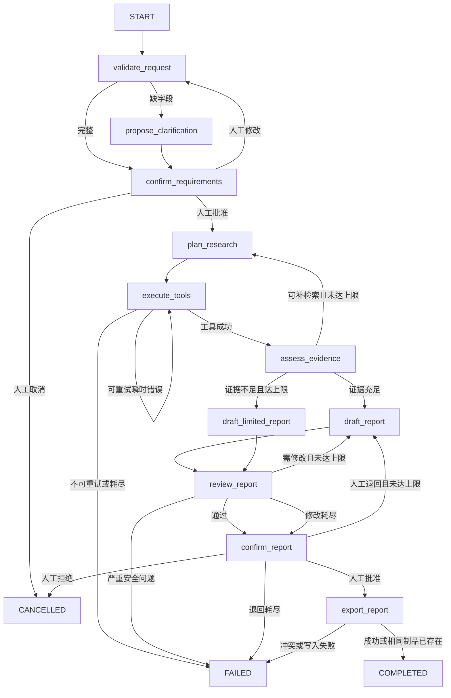
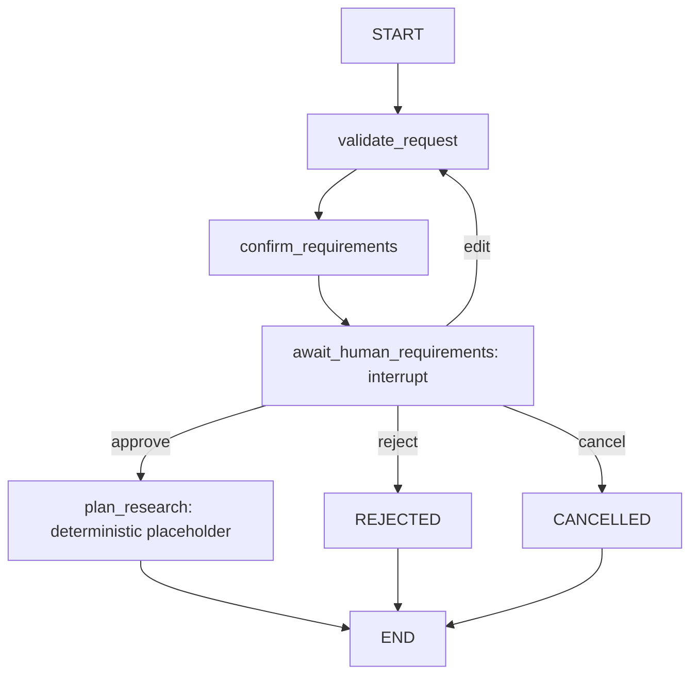

# P2 架构设计：LangGraph 技术选型研究工作流

- 版本：v0.2
- 状态：accepted design baseline
- 日期：2026-07-29
- 实现状态：最小状态合同与需求确认暂停路径已实现；完整检索、写作、审校和导出尚未实现

## 1. 架构目标

使用单个 LangGraph 工作流完成需求确认、研究规划、证据检索、报告写作、审校、人工确认和安全导出。重点不是“让模型自由行动”，而是把状态、权限、循环和停止条件交给程序控制。

P2 不复制 P1 代码，不导入 P1 内部模块，不复用 P1 `.venv`。只复用已验证的设计原则：来源固定、引用由程序绑定、普通测试离线、失败显式暴露。未来若复用 P1 检索能力，必须通过独立只读接口和版本化数据合同，不直接耦合实现。

## 2. 系统边界

```text
用户输入
  │
  ▼
输入校验 ── 人工确认需求
  │
  ▼
LangGraph 编排器
  ├─ 规划与写作模型适配器
  ├─ 受控 Tool Calling 执行器
  ├─ 证据与引用绑定服务
  ├─ 审校与路由规则
  ├─ Checkpoint 持久化
  └─ 人工批准后的幂等导出器

外部边界：
- 模型、数据快照和依赖尚未批准
- 首版无开放式联网搜索
- 首版无任意写工具
```

## 3. 显式状态图



`confirm_requirements` 和 `confirm_report` 使用 LangGraph 中断语义。进入节点前保存 checkpoint；恢复时必须提供同一 `run_id`、状态版本和合法人工动作。

### 3.1 当前已实现切片



- 完整需求、缺候选和缺评价维度都进入持久化 `NEEDS_HUMAN`，不自动补猜。
- `confirm_requirements` 在中断节点前写入等待状态、revision 和请求哈希。
- `await_human_requirements` 只接受严格、revision 绑定的 `approve`、`edit`、`reject`、`cancel`。
- `approve` 只到 `PLANNED`；当前没有检索、模型、报告或导出副作用。

## 4. 状态模型

状态使用严格结构化模型。未知字段拒绝；节点只返回自己负责的字段更新。

| 字段组 | 关键字段 | 说明 |
|---|---|---|
| 身份 | `run_id`、`thread_id`、`state_schema_version`、`graph_version` | 一次研究任务和可恢复状态身份 |
| 需求 | `research_question`、`audience`、`constraints`、`candidates`、`evaluation_dimensions`、`deliverable_requirements` | 已校验的用户需求 |
| 人工动作 | `pending_approval`、`approval_revision`、`human_decisions` | 只保存结构化决定、时间和安全摘要 |
| 规划 | `research_questions`、`search_plan`、`source_policy`、`plan_revision` | 已确认范围内的研究计划 |
| 工具 | `tool_requests`、`tool_results`、`tool_attempts`、`tool_call_budget` | 只保存校验后的参数和标准化结果 |
| 证据 | `evidence_items`、`evidence_gaps`、`source_snapshot_id` | 证据按来源、章节和内容哈希去重 |
| 报告 | `draft_revision`、`draft_sections`、`claims`、`citations`、`review_findings` | 草稿、声明和程序绑定引用 |
| 循环计数 | `retrieval_round`、`review_round`、`human_revision_round`、`structured_output_retry` | 所有循环的硬上限依据 |
| 运行状态 | `status`、`current_node`、`last_error`、`started_at`、`updated_at` | 可观察运行状态 |
| 观测 | `node_metrics`、`model_usage`、`tool_usage` | 延迟、调用次数、token 和已知费用 |
| 制品 | `approved_content_hash`、`artifact_id`、`export_status` | 只在最终批准后生成 |

不得保存：

- API Key、Cookie、鉴权头或连接字符串。
- 未脱敏异常堆栈。
- 完整敏感供应商请求和响应。
- 模型生成的任意本地路径、命令或可执行内容。
- 未进入允许资料快照的私有原文。

### 4.1 当前 `runtime-state-v1`

当前实现把数据分成四类：

1. 可持久化业务状态：
   - 身份和版本：`schema_version`、`graph_version`、`run_id`、`thread_id`。
   - 路由：`status`、`current_node`、缺失需求字段。
   - 需求：`raw_request`、`confirmed_requirements`、人工确认 revision 和请求哈希。
   - 有限循环：`tool_attempts`、`retrieval_rounds`、`review_rounds`、`human_revision_count`。
   - 后续占位：`evidence_ids`、安全 `errors`、报告 revision/hash、`artifact_id`、`idempotency_key`。
2. 运行时依赖：
   - 编译后的 LangGraph、SQLite 连接/checkpointer、模型客户端、工具执行器和密钥提供器。
   - 这些对象由运行环境创建或注入，不是业务状态。
3. 密钥和敏感响应：
   - API Key、Cookie、鉴权头、连接字符串、完整供应商请求/响应和未脱敏堆栈一律禁止进入 checkpoint。
4. 不可序列化或不应持久化对象：
   - 打开的文件、socket、数据库连接、线程锁、回调、模型 SDK 响应对象和任意可执行对象。

所有初始输入先经严格 Pydantic 合同校验，再提交给图。节点接收统一 `RuntimeState`，只返回自己负责的字段增量；SQLite checkpoint 中只出现基础类型、列表和映射。计数都有硬上限，未知字段和非法字段组合被拒绝。

## 5. 节点职责

### `validate_request`

- 对长度、数量、枚举、候选重复、权重和来源策略做确定性校验。
- 区分“输入非法”和“信息不足”。非法输入失败；信息不足进入澄清提案。
- 不调用模型，不访问网络。

### `propose_clarification`

- 只提出最少必要问题或候选默认值。
- 结构化输出失败最多再生成 1 次；仍失败则停止。
- 不把模型提案视为用户批准。

### `confirm_requirements`

- 暂停并展示规范化需求、候选、维度、权重、来源范围和预计调用上限。
- 只接受 `approve`、`edit`、`cancel` 三类结构化动作。
- `edit` 后重新走输入校验。

### `plan_research`

- 把已批准需求拆成研究问题和有限检索计划。
- 每个检索项必须绑定候选、评价维度和预期证据类型。
- 不能新增未批准候选、来源域或写操作。

### `execute_tools`

- 执行模型提出、程序校验后的 allowlist 工具调用。
- 控制单轮和全局调用预算；标准化、去重并记录结果。
- 工具参数错误返回稳定错误，不把原始异常交给模型。

### `assess_evidence`

- 检查每个候选和关键维度是否有来源、是否存在冲突、是否只剩弱证据。
- 默认最多 2 个检索轮次，含第一次检索。
- 达上限仍不足时进入“有限结论报告”，明确不能下强结论；不能伪装成成功检索。

### `draft_report` / `draft_limited_report`

- 只基于状态中的已验证证据写作。
- 模型只引用 `evidence_id`；程序绑定来源标题、版本、URL、章节和摘录。
- 有限报告必须把证据缺口放入执行摘要和结论。

### `review_report`

审校包含两层：

1. 确定性检查：结构完整、候选覆盖、引用 ID、来源范围、禁止字段、结论与评分一致。
2. 模型审校：检查比较公平性、证据与表述强度、矛盾、遗漏和可读性。

默认最多 2 轮自动修改。严重安全问题立即失败；修改上限后仍有非严重问题时，带警告进入人工确认。

### `confirm_report`

- 暂停并显示报告、证据缺口、审校警告、调用次数和已知费用。
- 只接受 `approve`、`request_changes`、`reject`。
- 人工退回最多 2 次。批准动作绑定具体 `draft_revision` 和内容哈希，旧批准不能授权新内容。

### `export_report`

- 不是模型可调用工具。
- 只接受状态中已批准的 revision 和内容哈希。
- 程序从 `artifact_id` 派生 allowlist 根目录下的安全路径。
- 临时文件完整写入并校验后原子替换；不执行报告内命令或链接。

## 6. Tool Calling

首版只允许三个只读或纯计算工具：

### `search_sources`

```text
输入：query、candidate_ids、source_types、top_k
输出：按固定快照检索的 EvidenceSummary 列表
```

边界：

- `query` 非空且最长 300 字符。
- `candidate_ids` 必须属于已批准候选。
- `source_types` 必须属于来源策略 allowlist。
- `top_k` 为 1～8。
- 不接收 URL、路径、命令或任意过滤表达式。

### `read_source`

```text
输入：source_id、section_id
输出：固定快照中的已验证章节、来源元数据和内容哈希
```

边界：

- 两个 ID 都必须来自已加载的来源目录。
- 不接收本地路径或 URL。
- 返回长度受限；完整来源响应不写入 checkpoint。

### `calculate_comparison`

```text
输入：候选、已批准维度权重、证据支持的标准化分值
输出：逐项加权结果、缺失值和计算过程
```

边界：

- 权重必须与人工批准版本一致，总和为 1。
- 分值范围固定；无证据时必须是缺失值，不能由工具补猜。
- 纯确定性计算，无网络和写操作。

Tool Calling 执行流程：

```text
模型提出调用
→ 工具名 allowlist
→ Schema 校验
→ 业务范围和权限校验
→ 调用预算检查
→ 幂等键/缓存检查
→ 执行
→ 标准化结果
→ 写入状态
```

## 7. 路由条件和停止条件

| 条件 | 路由 | 上限或终态 |
|---|---|---|
| 需求缺字段 | `propose_clarification` | 等待人工，不自动猜测批准 |
| 人工修改需求 | `validate_request` | 每次生成新 approval revision |
| 瞬时工具错误 | 重试当前工具 | 初次加 2 次重试，共 3 次尝试 |
| 参数、权限、404 或内容哈希错误 | 失败或重新规划 | 不自动重试相同调用 |
| 证据不足 | `plan_research` | 总计最多 2 个检索轮次 |
| 审校需修改 | `draft_report` | 最多 2 轮自动修改 |
| 人工退回 | `draft_report` | 最多 2 次 |
| 结构化模型输出非法 | 重生成当前输出 | 最多 1 次 |
| 人工取消或拒绝 | `CANCELLED` | 终态 |
| 安全违规、冲突写入、重试耗尽 | `FAILED` | 终态 |
| 已批准制品导出成功 | `COMPLETED` | 终态 |

等待人工的 `NEEDS_HUMAN` 是持久化暂停状态，不是成功。调用预算先于各节点循环上限；任一预算耗尽即停止，不能靠换节点绕过。

## 8. 重试策略

- 只重试超时、连接中断、HTTP 429 和明确的 5xx 瞬时错误。
- 指数退避参数在实现阶段固定；普通测试用虚拟时钟，不真实等待。
- 同一工具重试使用相同规范参数和相同逻辑调用 ID。
- 401、403、404、Schema 错误、allowlist 拒绝、内容哈希冲突和预算不足不重试。
- 模型重试不得静默增加候选、资料范围或输出权限。
- 每次失败写稳定错误码、安全摘要、节点和尝试次数；不保存密钥或完整供应商响应。

## 9. Human-in-the-loop

### 需求确认暂停

人工看到：

- 决策问题、候选、约束、评价维度和权重。
- 允许来源和禁止来源。
- 预计工具与模型调用上限。

人工可批准、修改或取消。批准记录绑定需求哈希。

### 最终报告暂停

人工看到：

- 完整草稿和引用。
- 证据缺口、冲突和审校警告。
- 运行耗时、调用次数、重试次数、token 和已知费用。

只有对当前内容哈希的 `approve` 能进入导出。恢复请求若 `run_id`、checkpoint 版本或批准哈希不匹配，安全失败。

## 10. 状态持久化

首版计划使用 P2 本地 SQLite checkpoint；具体 LangGraph checkpointer 包和精确版本在依赖提案阶段确认，不在本阶段安装。

规则：

- 每个节点成功后保存 checkpoint；人工暂停前强制保存。
- 使用稳定 `thread_id/run_id` 恢复，不用自然语言标题定位。
- checkpoint 带状态 Schema、图、Prompt 和来源快照版本。
- 版本不兼容时拒绝自动恢复；后续如需迁移，使用显式迁移脚本和测试。
- 并发恢复使用状态版本检查，旧客户端不能覆盖新状态。
- 持久化前脱敏；供应商原始响应只在内存解析，状态保存验证后字段和 usage。
- 测试可使用临时 SQLite 或内存替身；不得写入 P1 数据目录。

## 11. 幂等性

### 只读工具

- 规范参数加 `source_snapshot_id` 生成逻辑调用键。
- 相同调用优先返回已验证缓存。
- 证据以 `source_id + section_id + content_hash` 去重，节点重放不能重复追加。

### 节点重放

- 节点输出按 revision 替换，不盲目 append。
- checkpoint 恢复时，已完成且输出哈希匹配的确定性节点不重复执行。
- 模型节点重放是否允许由调用记录和预算共同决定；不把失败调用伪装成成功。

### 最终导出

```text
artifact_id = hash(run_id + approved_revision + approved_content_hash + format)
```

- 输出文件名由程序生成。
- 同一 `artifact_id` 已存在且内容哈希相同：返回 `UNCHANGED`。
- 同一 `artifact_id` 已存在但内容不同：返回冲突并失败，不覆盖。
- 写入过程使用同目录临时文件和原子替换。
- 未批准、批准已过期或哈希不匹配：拒绝写入。

## 12. 安全边界

- 工具 allowlist；无 shell、SQL、任意 HTTP、任意文件和部署工具。
- 模型不能决定 URL、路径、命令、工具实现、权限或最终写入。
- 来源目录保存可信 URL 和许可；模型只选择目录中的 ID。
- 所有路径先做相对路径语法校验，再解析并确认仍在允许根目录；拒绝符号链接和 junction 逃逸。
- 外部内容视为不可信数据。来源中的提示词不能改变系统规则、工具权限或输出边界。
- 最终报告中的命令和链接只作为文本，不自动执行或访问。
- API Key 只从环境变量读取并使用 Secret 类型；日志和 checkpoint 脱敏。
- 任何费用、真实下载、公开部署或高风险写操作继续需要单独批准。

## 13. 可观测性

每个节点记录：

- 节点名、开始和结束时间、结果状态。
- 模型与工具调用次数。
- 输入和输出 token；供应商提供时记录已知费用。
- 重试次数、稳定错误码和路由原因。
- checkpoint revision、来源快照和报告 revision。

不记录完整 Prompt、完整供应商响应或秘密。测试断言指标字段完整，但不依赖真实时钟。

## 14. 测试与评估设计

### 单元测试

- 状态 Schema、未知字段、版本和归并语义。
- 每条路由条件和所有循环上限。
- Tool Calling Schema、allowlist、预算和错误分类。
- 提示注入不能扩大工具权限。
- checkpoint 写入、恢复、版本冲突和脱敏。
- 人工批准绑定 revision 与内容哈希。
- 导出路径、原子性、重复调用和冲突。

### 集成测试

- 成功：需求批准、检索充分、审校通过、人工批准、导出一次。
- 失败：非法参数、权限拒绝、证据不足、重试耗尽、安全审校失败。
- 人工介入：需求修改、报告退回、取消、旧批准失效、恢复后继续。

全部普通测试使用假模型、固定工具夹具、预设人工动作和临时存储；不访问网络。

### 评估

- 固定至少 12 个场景，绑定图、Prompt、来源快照和评估集版本。
- 同时评估内容质量与工作流可靠性。
- 保存基线、失败样例、错误分类和同集回归。
- 真实模型评估单独标记；费用审批前不运行。

## 15. 依赖与实现边界

本阶段不选择或安装依赖。下一阶段依赖提案必须逐项给出：

- 精确版本。
- 用途和不可替代性。
- CPython 兼容性。
- 许可证。
- 是否触发下载、联网、费用或系统修改。

P2 将创建项目独立 `.venv`。在依赖与数据提案获得批准前，不创建完整 LangGraph 代码、不下载真实资料、不调用真实模型。

## 16. 后续可选扩展

只有固定评估证明多智能体在报告质量、成功率或成本效率上有净收益，才比较多智能体版本。比较必须使用同一评估集，并报告：

- 内容质量变化。
- 调用次数、token、费用和耗时。
- 新增失败模式。
- 调试和状态复杂度。

没有净收益，继续保留单工作流。
