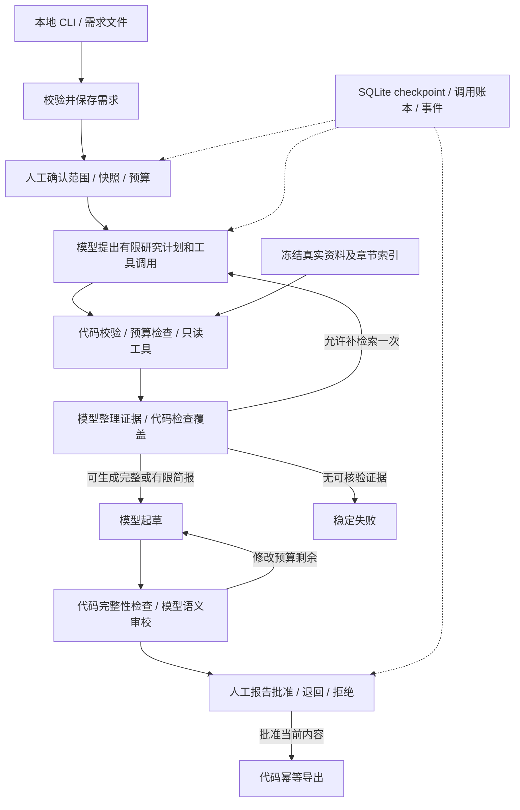

# P2 V2 技术架构

> 2026-09-16最终增量：248项测试通过，六题均完成生成与复核，2份带备注批准、4份拒绝，内容验收未通过。续期已同意并应用，不再等待；有效占用441/500分、100条调用预留已用满。以[18号结论](18-VALIDATION-CLOSEOUT.md)为准，下方阶段数字为历史。

- 版本：`p2-v2-architecture-0.5`；2026-09-14；D1 合同、D2 官方快照、D3 离线 MVP 与真实单样本闭环已实现；D4 已补发送前预算预留和审校返修门。
- 原则：保留现有 LangGraph 编排和安全边界，以适配器替换固定夹具；V1 回归不变。`demo/v2/` 只验证工作流行为，不提供现实技术结论。

## 1. 分层与职责

图示中的回边受全局预算、轮次及状态条件共同限制。任何超限先停止，不由模型决定是否继续。退回有独立计数，但不能重置总调用预算。

| 环节 | 模型负责 | 确定性代码负责 |
|---|---|---|
| 需求 | MVP 不用模型补需求 | Schema、缺失项、范围与批准 |
| 研究 | 查询词、读取目标 ID、子问题、缺口描述 | 工具 allowlist、目录成员、数量、调用次序与预算 |
| 证据 | 原子事实、相关性、支持/反证/未知、版本前提 | 原文片段存在、哈希、已读集合、候选与维度完整性 |
| 报告 | 综合比较、条件推荐、风险与建议 | 结构、引用元数据、范围、版本、固定模板和哈希 |
| 审校 | 语义支持、矛盾、表述强度、公平性建议 | 引用/状态不变量、修改上限、最终人工门 |
| 执行 | 无权改权限、费用、路径或下一节点 | 路由、错误、重试、恢复、计费预留和导出 |

代码只能验证原文存在，不能因此宣布语义支持成立。语义审校也是模型判断，必须独立评估，不能自批通过替代人工验收。

## 2. 模块与兼容策略

已在 `src/agent_research/v2/` 实现 `contracts.py`、`graph.py`、`model_client.py`、`source_store.py`、`source_collector.py`、`ledger.py`、`exporter.py`；工作流 CLI 在 `scripts/run_research_v2.py`，来源计划 CLI 在 `scripts/collect_sources_v2.py`，行为测试在 `tests/test_v2_*.py`。采集器和机器清单已通过安全边界、冻结闸门、HTTP mock 及一次 6 页固定 commit 快照验证；快照章节覆盖见 `09-SOURCE-COVERAGE.md`。`tools.py`、`evidence.py`、`reporting.py`、独立 runtime store 仍是后续 D4/D5 的拆分方向，不为堆模块提前重写。

- V1 `models.py`、`runtime_state.py`、gold 驱动写作/评估保持离线合同，不把 `Literal` 改成任意字符串来迁就真实资料。
- V2 使用 `ResearchRequestV2`、`RuntimeStateV2`、`SourceManifestV2`、`ReportV2`。状态版本 `runtime-state-v2`，图版本 `research-workflow-v2`；Prompt、工具、解析器另有内容哈希。
- 复用安全渲染/原子发布算法。现有 `SafeMarkdownExporter` 入参耦合 V1 `ReportDraft`，不能原封不动传入 V2；开发时抽出最小格式无关发布函数或实现 V2 薄适配层，并回归 V1 全部测试。
- V2 启动器只加载 V2 状态；V1 checkpoint 不自动迁移、不就地改库。版本不匹配提示使用原版本恢复或显式新建运行。
- 保留当前 LangGraph 1.2.9/SQLite 3.1.0 作为审查基线。开发阶段先审查 1.2.11/3.1.1 变更、安全公告与兼容性；无必要不把依赖升级与业务改造混在一起。任何安装必须另行批准。

## 3. 真实模型适配

定义窄接口 `ModelClient.generate(request) -> ModelResult`：请求包含任务类型、模型 ID、Prompt/Schema 版本、批准需求、有限证据和可用工具；结果包含结构化提案或工具调用、供应商请求 ID、finish reason、usage 与安全错误。

- `ScriptedModelClient` 仅用于离线测试；`DeepSeekV4FlashClient` 只在显式 live 模式构造，当前请求模型 ID 为 `deepseek-flash`，启动即验证 key、HTTPS endpoint 与价格卡，缺任一项失败，不回退假答案。
- 请求的 `model_config_hash` 现与实际适配器的 provider、model ID、base URL、timeout、输出上限、价格卡 hash 和协议版本绑定；`model-config` CLI 只输出该非秘密 hash，`live-preflight` 只验证本地 key/价格卡且不联网，图在首个人工门前拒绝不匹配配置。
- 第一家供应商已确认 DeepSeek；适配器仅使用 Python 标准库 HTTPS，不新增 SDK 或依赖。若后续协议要求 SDK，另做精确依赖提案；不先安装多个模型 SDK。
- 接口能力需分别测试：结构化输出、工具调用、usage、超时、错误码。所谓兼容接口不等于所有能力兼容；不支持必需能力时拒绝 live，不静默退化成正则猜测。
- 工具调用保留供应商 tool call ID 用于协议响应；权限与缓存使用程序生成的逻辑 ID。模型只能选择声明的工具名和已冻结目录 ID。
- 结构化结果用 Pydantic 再校验；只允许一次结构修复请求，计入模型与费用总预算。JSON 不合法、拒答、截断、缺 usage 分开记录，不能当作空成功。
- DeepSeek Chat Completions 适配器默认发送 `max_tokens=3000` 且关闭 thinking，同时保留供应商返回的 prompt/completion/reasoning token。价格卡按缓存未命中输入和保守汇率估算最坏费用；请求字节数和输出上限在发送前进入 SQLite 预算预留。预留以 `BEGIN IMMEDIATE` 串行化同一本账本的竞争连接；超时/崩溃不自动退款，避免重复收费。
- 供应商 response ID 不使用项目内部 ID 规则，改用受限、可记录的供应商 ID 字符集。若响应已到达但业务 JSON 无法通过 Pydantic，账本保存脱敏错误码和已解析 usage，状态保持 `RECOVERY_REVIEW`；不保存原始响应，也不自动重试。
- 模型审校必须返回 `review_completed` 与 findings。确定性代码先检查候选×维度矩阵、候选作用域及已读证据引用；findings 不为空时保存至第二个人工门，操作者明确选择返修才会再次起草。
- 草稿进入模型审校前，确定性范围门拒绝“整个冻结快照缺证据”的显式中英文模式；它以稳定错误码暂停到第二个人工门，不导出且不再支付审校调用。该模式门只补充模型审校，不替代原文语义复核。
- 供应商密钥只读 P2 环境变量，使用 Secret 类型；不自动加载 P1 `.env` 或继承 key 配置。Prompt 和日志不包含鉴权头、私密材料、模型隐藏推理。
- 普通模式完全禁止网络；live 只允许确认的供应商 HTTPS 主机。模型或来源不能修改 endpoint。

## 4. 真实资料和检索

采集与研究分开。先创建人工审查的 `docs/v2/source-plan-v1.json`，包括精确 URL/仓库路径、目标 commit/tag、许可链接、上限、用途。完成后采集到 `data/real-sources/<snapshot_id>/`。

MVP 12 页以内，优先公开仓库中的 Markdown 与 LICENSE，避免浏览器、PDF、图片和复杂 HTML 依赖。启动候选来源见 [研究记录](07-RESEARCH.md)。采集到真实仓库文件前核实文档路径和许可证覆盖范围；网站可浏览不等于整个网页可再分发。

Manifest 至少保存：`source_id`、candidate ID、canonical URL、仓库 commit/产品版本、访问时间、license 标识及证据、raw hash、normalized hash、parser version、相对文件名、字节数、标题与章节定位。网页版本无法核实则标明访问日期，不能推断适用于某 release。

采集限制：HTTPS、精确主机和路径 allowlist；重定向默认拒绝，人工更新清单后再取；禁止凭据 URL、非标准端口、私网/回环/链路本地目标；默认 opener 解析实际地址并拒绝私网、回环、链路本地、保留和未指定地址，降低 DNS rebinding 风险。没有完成此安全传输层前，仅人工批准的仓库原文采集，不实现任意 URL 工具。

只读研究工具：

- `search_sources(query, candidate_ids, dimension_ids, top_k)`：在批准快照章节中做确定性关键词检索、稳定排序；返回摘要及 evidence ID。中文需求使用模型生成英文技术查询词，必要时配置公开术语映射；不得按 eval case 返回 ID。
- `read_source(source_id, section_id)`：读取真实章节，限制单次文本大小（建议 8 KiB），返回版本/定位/哈希；已读取后才能被引用。搜索摘要不替代读原文。模型提出的单个搜索计划必须覆盖请求的全部候选和维度；程序按每个 candidate×dimension 用稳定维度查询、受控术语映射与候选过滤实际读取最多一条资料，避免模型关键词排序或泛化维度名遗漏已冻结的关键页面。
- `calculate_comparison(...)`：首个闭环不开放；扩展阶段实现真实 Decimal 加权运算。缺分保留 null，不当零分，不对剩余维度隐式重新归一化。分值只来自人工批准的量表和有证据的观察，主观「易用性」不得伪装成精确事实。

正文不进入一般日志；checkpoint 保存 evidence ID/摘要，全文留在不可变快照。摘要与引文都视为不可信数据，不能带来新的工具权限。

## 5. 状态、证据与报告合同

`RuntimeStateV2` 保存：运行身份、Schema/图版本、需求 revision/hash、来源 snapshot hash、模型配置/Prompt/tool policy hash、状态与当前节点、计划和轮次、验证后的工具提案、已读证据、证据矩阵、草稿 revision/hash、审校发现、人工审批绑定、预算授权 ID/账本游标、导出身份和安全错误。

运行时客户端、连接、文件句柄、锁、鉴权信息不进入状态。状态恢复时重新核对快照、版本和预算账本，不用自然语言标题定位任务。

证据矩阵以 candidate×dimension×requirement 为键。每个事实包含 claim ID、statement、证据 ID、原文范围/短引文、产品版本前提和 `supported/contradicted/unknown` 提案；程序校验作用域和片段，另存语义审校结论。未知维度也必须出现。

终态分开：`COMPLETED` 表示获批制品产生；`decision_status` 为 `recommended/conditional/insufficient_evidence`。无证据、内容完整性违规、模型失败、预算耗尽为 `FAILED` + code；取消/拒绝保留独立终态。未知计费和恢复冲突进入 `RECOVERY_REVIEW` 暂停，不伪装成功。

硬约束无证据或有未解决反证时不得推荐满足该约束的方案。可交付有限简报列出缺口；完全无有效证据则稳定失败。生产没有 `allowed_claims`、gold 推荐白名单或 expected 路由表。

## 6. 人工审批

第一次批准绑定 `run_id/thread_id`、需求 revision/hash、snapshot、模型配置指纹、资料范围、预算授权 ID 和限额。批准前不调用模型；改模型、资料、权限或加预算必须重新确认。

第二次批准绑定 run/thread、暂停 revision、报告 revision/hash、审校 hash 及来源 snapshot。报告正文、引用或限制变化均使批准失效。重复批准同一版本可以返回当前状态，不能重启研究或再次计费。

`interrupt()` 单独放在无外部调用的节点；前置节点先提交等待状态。恢复使用同一 `thread_id` 与 `Command(resume=...)`；不捕获吞掉 `GraphInterrupt`。该重放语义来自 [官方 Interrupts 文档](https://docs.langchain.com/oss/python/langgraph/interrupts)。

CLI 为本机单用户，不声称有认证或多租户隔离。应用管理目录不能由不可信其他进程写入。多人/远程访问须另设身份和权限设计。

## 7. checkpoint、幂等与崩溃窗口

P2 本地拟用 `data/runtime-v2/checkpoints.sqlite3`、`operations.sqlite3` 和 `artifacts/`，全部 Git 忽略。单进程、单活跃运行；跨进程用应用级互斥锁拒绝第二个执行器。锁持有者死亡后必须重新核对 operation 状态再恢复，不假设锁就是认证。

图 checkpoint 用现有 SQLite checkpointer，节点成功后保存；关键外部调用前后各自持久化操作账本。若使用可选 `durability="sync"`，先在锁定 LangGraph 版本上验证参数和崩溃测试。框架 checkpoint 不是远端事务，见 [Checkpointers](https://docs.langchain.com/oss/python/langgraph/checkpointers)。

调用键：`hash(run_id, node, input_hash, snapshot_hash, prompt_hash, model_config_hash, logical_revision)`；费用重试使用同一逻辑键、不同 attempt。工具缓存绑定快照/参数/工具版本；证据按 ID+内容哈希去重。

调用账本状态：`RESERVED`（预算预留、尚未标记发送）、`DISPATCHED`（持久化后才发请求）、`SUCCEEDED`（结果和 usage 已落盘）、`FAILED`、`UNKNOWN`。两本 SQLite 不宣称原子提交：恢复时先查账本，账本已有验证结果则重放到图，不能重发。

| 崩溃窗口 | 恢复规则 |
|---|---|
| 已预留、未 DISPATCHED | 可以释放/重用预留；尚未允许网络发送 |
| DISPATCHED、无持久化结果 | 请求可能已发送/计费，标 UNKNOWN，保留预留额度，暂停对账；不自动重试 |
| 结果已落账本、graph 未 checkpoint | 按调用键读取验证后结果，检查 hash 后重放到图，不新增调用 |
| 只读工具完成但未 checkpoint | 从快照重新计算或命中持久化缓存，内容须一致 |
| 报告发布但未 checkpoint | 沿用内容寻址、不覆盖发布；同字节 UNCHANGED |

不保证供应商 exactly-once。对 UNKNOWN，人工可核对请求记录后取消或明确批准额外尝试，最坏费用仍计入原预留；供应商支持幂等/查单时再单独适配。

最终制品 ID 绑定 run、批准 revision/hash、格式版本；程序生成文件名。V1 的硬链接发布算法保留，不支持同卷硬链接就失败，不回退覆盖；它不构成恶意同用户目录修改或断电持久性的完整保证。

## 8. 预算与失败策略

以下是建议上限，不是收费授权：

- 每运行最多 12 次模型请求（含规划、读取决策、证据整理、写作、审校、修复与重试），累计 input 48,000 / output 12,000 token；单请求上限 input 12,000 / output 3,000。
- 工具最多 16 次尝试；查询轮次最多 2；自动返修最多 1、人工返修最多 1；单次结构修复最多 1。任何局部余量不能绕过总预算。
- API 单请求超时建议 60 秒，主动执行总时间最多 10 分钟；人工等待不计主动时间；暂停超过 7 天要求重新确认配置与资料时效。
- 明确 429、可重试 5xx/连接建立前失败最多再试 1 次；支持 Retry-After，等待上限 30 秒。已发送后超时/断连按 UNKNOWN；401/403、参数/权限拒绝、来源 hash 错、预算不足不重试。虚拟时钟测试退避，不在单测真实 sleep。

### 跨运行目录总额边界

`OperationLedger` 在同一 SQLite 文件内串行化同一授权的预留；独立 runtime 目录会拥有独立账本。2026-09-14 的 D5 多子批复核证明，这不足以实现用户设定的跨目录 P2 总额。live CLI 现要求 `--total-budget-file` 和 `--total-budget-ledger`：本地批次预留成功后、网络发送前，以同一最坏 token/费用边界写入共享总账本；总账本不足时不发送，本地预留可保守保留。图测试覆盖总账本阻止第三次发送，CLI 测试覆盖缺总额文件时的网络前拒绝。历史独立账本不能自动回填；恢复前仍需依据刷新后的供应商账单填写剩余额度，不能重新配置完整 ¥5。该机制还需覆盖重启、并发进程、授权更换和供应商账单未刷新情况。
- 发送前原子检查「已结算费用 + 未结算最坏预留 + 本次最坏费用」不超过授权。费用使用 Decimal/最小货币单位，汇率与价目版本一并冻结。
- token 预估不是硬保证。优先供应商计数端点或正式 tokenizer；若不可用，使用经过验证的保守字节上界加协议开销，若仍不能建立上界则拒绝收费模式。输出上限必须由供应商参数实际支持，含可计费 reasoning token。当前 V2 适配器在价格/费用未知时记录 `unknown` 并停在 `RECOVERY_REVIEW`，不会把未知费用写成零。
- usage 缺失为 unknown，不写 0；未知费用不释放预留。供应商价格/协议变更必须重新确认。30 元只是建议评估封顶，可能不足以完成全部样本，届时停止并报告未完成项。

## 9. 可观测性与演示

账本为调用/成本事实来源；单独持久化脱敏事件，字段包括 event ID、run/node/attempt、开始/结束时间、结果、error code、模型版本、usage、cost status、缓存命中、审批 revision、snapshot 和报告 hash。事件 ID 幂等，允许记录有 start 无 finish 的崩溃，不补造成功事件。

区分主动耗时、人工等待和总墙钟时间。禁止默认外送 tracing；不记录完整 Prompt/供应商响应或隐藏推理。验证后的公开事实、草稿与引用可进入受控业务存储，大小受限；摘要报告中的敏感模式先检查，正则脱敏不当作完美隐私保证。

先展示真实 CLI 四条路径：成功、缺证据不推荐、人工退回、进程退出后恢复；附一次 live 报告与成本（获批后），离线 replay 显式标记。本地静态展示页/截图只引用真实产物；没有实际服务就不展示云端运行或多用户指标。

### 2026-09-15 实现更新

只读检索以实际2400字符摘录、章节及来源标题排名，词频封顶；先candidate×dimension覆盖，再每候选补一条research_question查询，证据去重。预算预留仍在模型请求发出前执行，补读不扩大既有授权。

草稿若decision_status与recommendation有无矛盾，报告门留下REPORT_DECISION_INCONSISTENT；返修意见保留至下一草稿，新审校替换旧意见。markdown-v2.1增加每格限制、候选及定位/hash；已有旧制品先验证legacy字节并复用，不覆写。最新证据与验证边界见v2交付审计13号文档。
