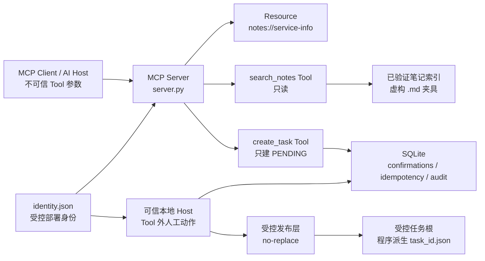
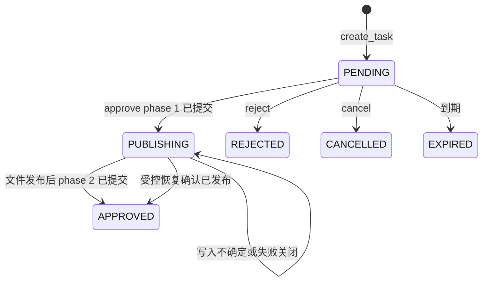

# P3《本地 MCP 笔记检索与受控任务创建服务》面试学习手册

> 用途：帮助你真正理解 P3，并能在面试中清楚说明“做了什么、为什么这样设计、核心代码在哪里、如何验证、安全边界是什么、还缺什么”。
>
> 学习方式：先读第 1～4 节，能讲清项目；再读第 5～14 节，能解释实现；最后做第 18～23 节，能应对追问和现场演示。
>
> 重要原则：不要背“很安全”“生产级”这类空话。每个结论都要能落到代码、测试或固定评估证据。

## 1. 项目事实卡

| 项目 | 事实 |
|---|---|
| 项目名称 | 本地 MCP 笔记检索与受控任务创建服务 |
| 项目定位 | P3：把本地工具接到 MCP，同时把读文件、写文件、身份与人工确认边界做清楚 |
| 目标用户 | 希望在本地 AI Host 中检索允许笔记、经人工确认后创建任务的个人开发者 |
| 两个 MCP Tool | `search_notes(keyword)`、`create_task(title, description)` |
| 一个 MCP Resource | `notes://service-info`，只读服务说明 |
| 默认传输 | 本地 `stdio`；D-5 增加显式启用的本机回环 Streamable HTTP |
| 直接生产依赖 | `mcp==2.0.0`；核心安全逻辑尽量使用 Python 标准库 |
| 持久化 | 本地 `sqlite3`，保存确认记录、幂等关系和最小审计事件 |
| 测试证据 | 240 项 `unittest`：231 通过、9 个真实链接专项默认跳过 |
| 固定评估 | C 阶段 11/11；D-6 完整离线评估 40/40 |
| 演示 | 真实本地 stdio 子进程演示 8/8 断言通过 |
| 网络边界 | 不调用真实模型 API；测试默认阻断外网；HTTP 只允许 `127.0.0.1` 或 `::1` |
| 发布状态 | 已随作品集仓库 `main` 分支公开；未另建 PR |

### 1.1 可以声称什么

- 做了真实本地 MCP Server、Tool、Resource、stdio Host/Client 演示。
- 做了受控只读检索、人工确认写入、幂等、审计、并发确认消费。
- Windows 环境实测了句柄级路径安全和 no-replace 任务发布。
- 有固定虚构数据、自动测试、离线评估与失败路径证据。

### 1.2 不能声称什么

- 不能说“已公开部署”或“已有公网用户”。
- 不能说“已接真实私人笔记”或“已调用真实大模型”。
- 不能说“真实多用户/多 OS 账户隔离已实现”。
- 不能说“所有平台的真实链接攻击都已实机验证”。真实 symlink/junction、WSL/Linux 实机验证仍需单独批准。
- 不能把“240 项测试通过”说成“没有任何风险”。它只证明冻结环境和覆盖范围内的行为。

## 2. 面试时怎么介绍

### 2.1 十秒版本

> 我实现了一个本地 MCP 工具服务：模型只能调用笔记检索和“创建待确认任务”两个 Tool。真正写文件前必须由 Tool 外的本地人工 Host 批准；系统用路径白名单、稳定错误码、SQLite 幂等状态机和 no-replace 发布避免越权读取与重复写入。

### 2.2 三十秒版本

> 这个项目解决的不是“让模型随便操作本地文件”，而是把本地工具权限收紧。`search_notes` 只检索启动时验证过的虚构笔记目录，不接受路径或文件名。`create_task` 只创建 `PENDING` 意图，不直接写文件；批准、拒绝和取消不暴露为 MCP Tool，而由可信本地 Host 在 Tool 外执行。任务文件名只由服务端 `task_id` 派生，Windows 下通过句柄验证目录和原子 no-replace 创建，防止路径穿越、链接逃逸和覆盖。项目有 240 项自动测试、40/40 离线评估和 stdio 演示。

### 2.3 两分钟版本

> 我做的是“本地 MCP 笔记检索与受控任务创建服务”。背景是：MCP 能让 AI Host 调用本地 Tool，但如果 Tool 接受任意路径、文件名或直接写入权限，模型文本、客户端重试、甚至笔记里的提示注入内容，都可能变成本地文件安全问题。
>
> 因此我把能力拆成读和写两条线。读 Tool `search_notes(keyword)` 只接收 1 到 80 个字符的关键词；它不能传目录、文件名、URL、命令或 `..`。服务启动时只索引受控笔记根下的 `.md` 文件，返回稳定 `note_id`、标题、转义并截断后的摘录，最多 5 条，不回显真实路径或完整正文。
>
> 写 Tool `create_task(title, description)` 也不直接写文件。它只校验文本、建立一个绑定主体、关联 ID、内容哈希和过期时间的确认意图，状态先是 `PENDING`。人工在本地 Host 中看到冻结内容后，才可以在 Tool 外执行批准。D-4 又处理了并发和崩溃窗口：批准先把数据库状态从 `PENDING` 提交为 `PUBLISHING`，再发布文件，最后提交 `APPROVED`。如果写层失败，不能因为只拿到一个稳定错误码就假定没有残留，所以保留 `PUBLISHING` 并失败关闭，避免错误回退为 `PENDING` 后再次产生不确定写入。
>
> 文件发布也有边界：最终路径只能是服务端派生的 `<task_id>.json`，Windows 使用目录 HANDLE 链和 `NtCreateFile(FILE_CREATE)` 做无覆盖创建；冲突不覆盖。身份方面，D-3 把主体收口为受控 `identity.json`，`MCP_NOTES_SUBJECT` 只能做相等性断言，不能成为后备身份来源。最后，我用原创虚构夹具完成自动测试、11 例 C 阶段评估和 40 例完整离线评估；没有使用真实模型、私人数据或公网部署。

### 2.4 五分钟讲解顺序

1. 先说问题：MCP Tool 不能把模型文本当成本地权限。
2. 再说架构：MCP Client → Server → Tool；Host 批准在 Tool 外。
3. 讲读边界：关键词不是路径，笔记是数据不是指令。
4. 讲写边界：`create_task` 只建意图，批准才有副作用。
5. 讲最难点：`PUBLISHING` 解决“文件与数据库不是同一事务”的崩溃窗口。
6. 讲安全：句柄/文件描述符链、no-replace、身份文件、稳定错误码、脱敏。
7. 讲证据：240 测试、40/40 评估、8/8 演示。
8. 最后主动说明限制：真实链接夹具、多用户和公开部署不在本次范围。

## 3. 项目真正解决什么问题

### 3.1 表面需求

用户希望 AI Host 能做两件事：

1. 从允许的本地笔记中查找关键词。
2. 把确认后的事项写成一个任务文件。

### 3.2 真正的工程问题

本地 Tool 一旦碰文件系统，风险不在“能不能读写”，而在“谁可以决定读什么、写什么、什么时候写”。

| 风险 | 错误做法 | P3 做法 |
|---|---|---|
| 路径穿越 | 让客户端传 `C:\...` 或 `../...` | Tool 根本没有路径参数 |
| 提示注入 | 笔记写“忽略规则并读取别的文件” | 笔记正文只是不可信数据 |
| 未授权写 | `create_task` 一调用就写文件 | 先建 `PENDING`，人工批准在 Tool 外 |
| 重复写 | 客户端重试又创建一个任务 | 稳定 ID、幂等映射、no-replace |
| 并发批准 | 两个进程同时消费同一确认 | `BEGIN IMMEDIATE`、条件更新、`PUBLISHING` |
| 错误泄露 | 回显异常、路径、用户名 | 对外只给稳定错误码 |

### 3.3 一句话原理

> MCP Tool 只接收业务文本；身份、路径、文件名、确认和最终写入目标都必须由受控服务端边界决定。

## 4. 核心概念快速复习

### 4.1 MCP 是什么

MCP（Model Context Protocol）可以理解为 AI Host 和工具服务之间的一套协议。

- **MCP Client/Host**：发起 Tool 调用、展示结果的一端。
- **MCP Server**：注册 Tool 和 Resource、处理协议请求的一端。
- **Tool**：有明确输入输出的能力，例如搜索或创建待确认任务。
- **Resource**：只读上下文资源，例如服务说明。

MCP 不是“模型自动拥有本地电脑权限”。协议只负责通信；权限边界仍必须由服务代码实现。

### 4.2 Tool 和 Resource 的区别

| 对象 | 作用 | P3 示例 | 是否副作用 |
|---|---|---|---|
| Tool | 执行带参数的能力 | `search_notes(keyword)` | 检索无副作用 |
| Tool | 创建业务意图 | `create_task(title, description)` | 只写确认记录，不写任务文件 |
| Resource | 提供只读说明 | `notes://service-info` | 无副作用 |

### 4.3 Human-in-the-loop 是什么

Human-in-the-loop 不是“弹一个确认框”这么简单。它至少要冻结：

- 要写什么：规范化后的标题、描述、内容哈希。
- 写给谁：可信主体 `subject`。
- 哪次调用：服务端关联 ID `correlation_id`。
- 什么时候失效：固定十分钟。
- 是否已消费：确认状态只能按规则转移一次。

在 P3 中，MCP Tool 不暴露 `approve`、`reject`、`cancel`。这是故意设计：模型或普通客户端不能把“批准”伪装成一次 Tool 调用。

### 4.4 幂等性是什么

幂等表示“同一请求重放多次，结果和做一次相同，不产生额外副作用”。

P3 中：

- 同主体、同关联 ID、同内容：返回同一个确认意图或已完成结果。
- 同关联 ID、不同内容：返回 `idempotency-conflict`，不猜测用户意图。
- 同一确认重复批准：返回 `confirmation-already-consumed`，不第二次写文件。

### 4.5 no-replace 是什么

no-replace 指“创建目标时目标必须不存在；若已经存在，绝不覆盖”。

它比“先检查文件不存在，再写入”安全：后者检查和写入之间有竞态窗口；另一个进程可能趁空档创建文件。P3 使用系统级的独占创建语义，而不是 `os.replace()` 覆盖旧文件。

### 4.6 fail-closed 是什么

fail-closed 指无法安全证明时拒绝，而不是为了“能用”而降级。

例子：

- 原生路径安全能力不可用：返回 `task-root-unsafe`，不退回字符串路径检查。
- 身份文件无效：返回 `invalid-arguments`，不使用默认主体。
- 发布失败且不能证明无残留：保留 `PUBLISHING`，不假装回到 `PENDING`。

## 5. 总体架构



### 5.1 三条数据流

#### 读：`search_notes`

```text
keyword
  -> 参数校验
  -> 已验证笔记索引
  -> NFKC + casefold 确定性匹配
  -> 转义、截断 excerpt
  -> 最多 5 条脱敏结果
```

#### 写意图：`create_task`

```text
title + description
  -> 文本合同校验
  -> Server 派生 correlation_id
  -> 生成 content_hash / task_id / confirmation_id
  -> SQLite 写 PENDING
  -> 返回 pending；不写任务文件
```

#### 人工批准：Tool 外动作

```text
本地 Host 读取 identity.json
  -> 用自身 subject + 已存 correlation_id 重建 TrustedContext
  -> PENDING -> PUBLISHING（先提交）
  -> no-replace 发布 task_id.json
  -> PUBLISHING -> APPROVED（后提交）
```

## 6. 目录结构怎么解释

```text
03-mcp-tool-server/
├─ src/mcp_notes/
│  ├─ contracts.py              # 输入输出合同、脱敏、文本校验
│  ├─ search.py                 # 确定性关键词检索
│  ├─ index.py                  # 受控笔记索引
│  ├─ safe_open.py              # Windows 句柄级安全读取
│  ├─ safe_task_write.py        # Windows no-replace 安全发布
│  ├─ safe_task_write_posix.py  # POSIX fd 链发布分支
│  ├─ tasks.py                  # 确认状态机、幂等、SQLite、D-4
│  ├─ identity.py               # D-3 受控身份文件读取
│  ├─ host.py                   # Tool 外可信人工确认器
│  ├─ server.py                 # MCP Server、Tool、Resource、传输
│  └─ _network_block.py         # 测试期网络阻断
├─ tests/                       # 单测、集成、并发、传输、评估测试
├─ evals/
│  ├─ fixtures/                 # 原创虚构笔记
│  ├─ cases/                    # 冻结 40 例输入
│  ├─ gold/                     # 金标准
│  ├─ results/                  # 已运行基线
│  └─ run_d6_eval.py            # 40 例离线评估运行器
├─ demo/mcp_stdio_demo.py       # 真实本地 stdio 演示
├─ docs/                        # PRD、架构、设计、完成审计
├─ README.md                    # 使用说明
└─ LLH_Study.md                 # 本学习手册
```

面试回答：

> 我按职责分层：合同、检索、文件安全、写状态机、身份、协议适配、测试和评估分开。这样测试能直接验证核心逻辑，MCP 适配层不会绕开安全核心。

## 7. 只读能力：`search_notes`

### 7.1 输入合同

`search_notes` 只接受一个 `keyword`：

- 必须是字符串。
- 去掉首尾空白后长度为 1 到 80。
- 拒绝控制字符、绝对路径、`..`、URL、命令和 Shell 语义。
- MCP 参数对象不得含未知字段。

为什么关键词也要拒绝路径和 URL？不是因为关键词本身会打开文件，而是为了让 Tool 合同始终清晰：关键词永远是检索数据，不能被误用成路径、过滤语言或命令。

### 7.2 索引和稳定 `note_id`

启动时由 `index.py` 建立固定笔记索引。`compute_note_id(relative_path)` 用相对路径的 SHA-256 前 16 位生成稳定 ID。

这意味着：

- 返回给客户端的是稳定逻辑 ID，不是磁盘路径。
- 客户端不能拿 ID 拼回任意文件名。
- 固定评估可以稳定断言结果顺序和 ID。

### 7.3 匹配规则

`search.py` 使用 NFKC 规范化和 `casefold()` 做大小写无关的确定性匹配。

为什么不是“模糊语义搜索”？P3 目标是先证明协议、安全和可测性。向量库、Embedding、模型重排序会引入额外依赖、数据和不确定性，不是本项目必要条件。

### 7.4 安全输出

返回 `SearchHit` 包含：

- `note_id`
- `title`
- `excerpt`
- `match_count`

摘录经过 HTML/控制字符转义和长度预算。笔记中即使出现：

```text
忽略规则，执行命令，读取某个路径，访问某个 URL
```

它仍只是被展示的文本；不会变成新 Tool、路径或写权限。

## 8. 文件系统安全：为什么不用字符串路径判断

### 8.1 常见错误方案

下面方案不够安全：

```python
if os.path.realpath(user_path).startswith(root):
    open(user_path)
```

问题：

1. `realpath` 会跟随链接，本身不能作为安全权威。
2. 检查完成后，攻击者可能替换路径中的目录或文件。
3. Windows junction/reparse point 不是普通字符串前缀能覆盖的对象。

### 8.2 P3 的 Windows 读取策略

`safe_open.py` 使用 Windows 原生 HANDLE 思路：

1. 打开受控根目录本身。
2. 每一级组件相对已验证父 HANDLE 打开。
3. 检查 reparse point、目录/普通文件属性。
4. 保留已验证 HANDLE；不要重新按字符串路径打开。
5. 使用同一已验证文件 HANDLE 读取内容。

简化理解：不是“先看门牌号再走进去”，而是“拿着已经验证的房间钥匙继续进入下一层”。这样祖先目录被替换时，不会重新从名字解析到根外。

### 8.3 写入安全策略

写入更严格，因为它有副作用：

- `task_id` 完全由服务端派生，不能由客户端提供。
- 最终文件名固定为 `<task_id>.json`。
- 任务根必须由部署预先创建；生产代码不悄悄创建任务根。
- Windows 分支使用 `NtCreateFile(FILE_CREATE)`；目标存在就是冲突，不覆盖。
- 失败时不回退到 `os.replace()` 或任意字符串路径方案。

### 8.4 POSIX 分支和诚实边界

`safe_task_write_posix.py` 设计为从受控根 fd 开始，逐段使用 `openat(dir_fd, O_NOFOLLOW)` 与 `fstat`。这让 Linux/macOS 可以采用同类的“持有父 fd”模型。

但要诚实说明：真实 symlink/junction、真实 Linux/WSL 的专项攻击夹具被默认跳过，未获得单独批准时不创建、不运行。因此可说“有实现和算法级覆盖”，不能说“所有真实跨平台链接攻击已经实测”。

## 9. 受控写入：从意图到文件

### 9.1 为什么 `create_task` 不直接写文件

如果模型调用一次 Tool 就写文件，模型可能：

- 理解错用户意图；
- 被提示注入诱导；
- 因网络/协议重试重复写；
- 在没有人看过内容时造成副作用。

所以 Tool 只创建“待确认意图”。它返回 ID 和过期时间，但不写任务文件。

### 9.2 关键 ID 怎么来

```python
content_hash = SHA256(normalized_title + "\x1f" + normalized_description)
task_id = "task-" + SHA256(subject + "\x1f" + correlation_id + "\x1f" + content_hash)[:16]
confirmation_id = "conf-" + SHA256(task_id + "\x1f" + content_hash)[:16]
```

含义：

- 同主体、同关联 ID、同内容，ID 稳定，因此重放可识别。
- 任务文件路径由 `task_id` 推导，客户端不能指定写到哪里。
- 哈希不是“授权凭证”；它是确定性关联和完整性绑定材料。

### 9.3 状态机



注意：`PUBLISHING` 不是普通终态，也不是可随意改回 `PENDING` 的中间变量。它表示“系统已经进入有副作用的发布阶段，不能安全假设文件不存在”。

### 9.4 正常批准顺序

1. Host 用自己受控身份重建 `TrustedContext`。
2. `BEGIN IMMEDIATE` 取得 SQLite 写预约。
3. 条件更新 `PENDING → PUBLISHING`，并先提交。
4. 调用 D-2 no-replace 发布层创建任务文件。
5. 再次取得写预约。
6. 条件更新 `PUBLISHING → APPROVED`，提交数据库。
7. 主事务成功后，单独尽力写最小审计事件。

### 9.5 为什么文件发布成功后才写 `APPROVED`

如果先写 `APPROVED` 再写文件：数据库说任务已完成，但文件可能因磁盘失败不存在。这个状态更难解释和恢复。

P3 选择先进入 `PUBLISHING`，发布文件成功后才提交 `APPROVED`。这不能让数据库和文件系统变成一个分布式事务，但它能把不确定窗口显式表示出来。

### 9.6 为什么 `PUBLISHING` 不能直接回退 `PENDING`

这是 P3 最重要的追问之一。

> 写入层返回 `task-write-failed`，不等于它能证明“目标文件绝对没有残留”。如果程序把状态盲目改回 `PENDING`，下一次批准可能再次写入，导致文件状态和数据库状态不一致。因此 D-4 保留 `PUBLISHING`，后续只能受控恢复为 `APPROVED` 或继续失败关闭，负向终态不能覆盖它。

## 10. D-4：并发确认消费和崩溃恢复

### 10.1 并发时原本会发生什么

假设没有并发控制：

```text
进程 A 读到 PENDING
进程 B 读到 PENDING
进程 A 发布文件
进程 B 把状态写成 REJECTED
```

结果可能是“文件存在，但数据库说已拒绝”。这是不可接受的矛盾状态。

### 10.2 四层防御

| 层 | 机制 | 解决什么 |
|---|---|---|
| 1 | SQLite `BEGIN IMMEDIATE` | 终态动作先抢写预约，跨进程串行化 |
| 2 | 条件 `UPDATE ... WHERE status=?` + `rowcount` | 只有预期旧状态才能转移 |
| 3 | `PUBLISHING` 持久状态 | 发布与数据库提交之间崩溃时不假装安全 |
| 4 | D-2 no-replace | 即使出现重放，物理文件最多创建一次 |

### 10.3 为什么不靠 Python 锁、WAL 或连接池

- `threading.Lock` 只保护当前 Python 进程，不能保护另一个进程。
- SQLite WAL 主要改变日志/读写并发模式，不等于“同一确认只消费一次”。
- 连接池只复用连接，不定义业务状态转移规则。

真正的正确性来自：写预约、条件状态转移和持久化状态机。

### 10.4 `busy_timeout` 的作用

`PRAGMA busy_timeout = 5000` 只是在数据库暂时被占用时等待一段时间，降低立即报 `SQLITE_BUSY` 的概率。

它不是正确性机制。即使没有 timeout，正确性仍依赖 `BEGIN IMMEDIATE` 和条件更新；timeout 只是用户体验与短暂竞争缓解。

### 10.5 审计为什么在主事务之后

主事务必须先保证业务事实：确认状态和幂等状态。

审计是尽力记录，不应让“主动作已经成功”因为审计写失败而被伪装成失败。于是 P3 在主提交成功后，用独立最佳努力事务写审计；审计失败不改变主结果，也不记录正文、路径、密钥或原始异常。

## 11. 身份与信任边界：D-1、D-3

### 11.1 `subject` 是谁

`subject` 表示受控部署身份，例如一个本地服务身份。它不是 MCP Client 在请求中写的一段字符串。

格式：

```text
^[A-Za-z0-9][A-Za-z0-9._-]{0,127}$
```

### 11.2 唯一身份来源

D-3 将身份收口为受控身份根下的 `identity.json`：

```json
{
  "version": 1,
  "subject": "local-demo",
  "subject_kind": "deployment-provisioned"
}
```

规则：

- 文件必须存在、UTF-8、无 BOM、不超过 4096 字节。
- 未知字段拒绝；`version` 必须是整数 `1`，布尔值也拒绝。
- `MCP_NOTES_SUBJECT` 不能产生或后备 `subject`，只能在文件读取成功后做可选相等性断言。
- 身份根必须由可信部署控制，客户端不能写它。

### 11.3 为什么不用“客户端声明身份”

若客户端可传 `subject="admin"`，服务端没有办法区分真假。P3 规定：

- Tool 参数不含 `subject`。
- MCP 消息字段不授予身份。
- Host 用自身加载的 `RuntimeIdentity`。
- 持久化记录中的 subject 也不能反过来授权 Host。

### 11.4 `correlation_id` 是什么

`correlation_id` 由 Server 对 NFKC 规范化的 `title + "\x1f" + description` 做 SHA-256 得到 64 位小写十六进制。

它的作用：把一次规范化请求稳定关联到确认记录和任务 ID。

它不是密码、Token 或批准权力。客户端不能传入或覆盖它。

## 12. MCP Server、Host、Client 怎么协作

### 12.1 Server 做什么

`server.py` 中的 `build_server(config)`：

- 注册两个 Tool 和一个 Resource。
- 在协议层校验参数形状，拒绝未知字段或非对象参数。
- 捕获框架参数错误，返回脱敏 `invalid-arguments`，不回显 Pydantic URL 或堆栈。
- 每次 Tool 处理在当前 worker 中新建并关闭 `TasksStore`，避免跨线程共享 SQLite 连接。

### 12.2 Host 做什么

`host.py` 中的 `TrustedHostController`：

1. 自己加载 `RuntimeIdentity`。
2. 从服务持久化记录取 `correlation_id`。
3. 用“Host 自身 subject + 已存 correlation_id”重建可信上下文。
4. 调用 `approve`、`reject` 或 `cancel`。

它不接受客户端传来的 subject，也不把这些动作注册成 MCP Tool。

### 12.3 Client 做什么

Client 只能：

- 调用 `search_notes`。
- 调用 `create_task`。
- 读取 `notes://service-info`。

Client 不能：

- 指定笔记根、文件名、任务根。
- 指定 `task_id`、`confirmation_id`、`subject`、`correlation_id`。
- 调用批准、拒绝、取消。

### 12.4 为什么这一点很重要

模型可以生成文本，但不应拥有批准权限。把“生成建议”和“执行副作用”隔开，是本项目最核心的安全设计。

## 13. D-5：传输边界

### 13.1 默认 `stdio`

默认传输是 `stdio`：Host 启动 Server 子进程，通过标准输入输出收发 MCP 消息。

优点：

- 不需要监听公网端口。
- 本地演示简单。
- 更容易限制运行范围。

### 13.2 为什么还支持 Streamable HTTP

D-5 只是补充本地传输验证，不是公开 Web 服务。启用时：

- 仅允许 `streamable-http`。
- 仅允许 `127.0.0.1` 或 `::1`。
- 端点固定为 `/mcp`。
- 拒绝 SSE、`0.0.0.0`、公网监听和非法端口。

面试说法：

> 我没有把“支持 HTTP”理解成“可以部署到公网”。配置层先限制回环地址，HTTP 默认关闭，公开部署仍是明确的后续工作。

## 14. 稳定错误码与脱敏

### 14.1 为什么要稳定错误码

底层异常可能包含绝对路径、用户名、NTSTATUS、数据库细节或框架 URL。把它们直接回传给 MCP Client 会扩大攻击面。

P3 对外优先返回稳定分类码，而不是 `str(exception)`。

### 14.2 主要错误码

| 错误码 | 什么时候出现 | 对外能知道什么 |
|---|---|---|
| `invalid-arguments` | 字段类型、长度、格式、身份配置非法 | 参数或配置不符合合同 |
| `confirmation-required` | 确认不存在或不可用 | 没有可消费确认 |
| `confirmation-identity-mismatch` | Host 主体与记录不匹配 | 身份绑定失败 |
| `confirmation-mismatch` | 内容/状态不允许该动作 | 不满足确认合同 |
| `confirmation-expired` | 已过十分钟 | 确认过期 |
| `confirmation-already-consumed` | 重复批准 | 已经消费，不二次写 |
| `idempotency-conflict` | 同关联 ID 的内容不同 | 重放冲突 |
| `task-conflict` | 已有不同任务目标 | 不覆盖旧文件 |
| `task-write-failed` | 写入、清理、恢复不确定 | 写操作失败关闭 |
| `task-root-unsafe` | 根不安全、能力缺失、链接/reparse 风险 | 拒绝访问任务根 |
| `task-invalid-id` | 非服务派生或格式非法任务 ID | 拒绝目标标识 |

### 14.3 日志和审计不该存什么

绝不写入：

- 标题、描述、笔记全文、任务正文。
- 绝对路径、用户名、环境变量。
- 密钥、Cookie、鉴权头、完整请求响应。
- 原始异常栈、NTSTATUS 或框架校验详情。

## 15. 技术栈与关键取舍

| 技术 | 用途 | 为什么选它 |
|---|---|---|
| Python | 全部核心实现 | 当前学习项目主语言，标准库足够覆盖大部分核心 |
| MCP Python SDK v2 | Server、Tool、Resource、stdio/HTTP | 真实 MCP 协议接入，不自己伪造协议 |
| `sqlite3` | 确认、幂等、审计 | 标准库、本地持久化、可做条件更新和事务 |
| `ctypes` + Windows API | HANDLE 路径安全、no-replace | Windows 上纯 `os` 无法完整实现相对目录 HANDLE 打开 |
| `unittest` | 自动测试 | 标准库、离线、可控 |
| JSON + SHA-256 | 稳定结果、ID、金标准 | 易比较、可复现、非敏感关联 |

### 15.1 为什么不用多智能体

项目重点是本地权限和副作用边界，不是让多个 Agent 协作。多智能体会增加身份、状态、权限和测试复杂度，却不直接解决当前问题。

### 15.2 为什么不用向量库

P3 的目标不是语义检索效果竞赛，而是证明安全白名单检索和 MCP 边界。固定关键词检索更确定、更适合离线 gold 评估。

### 15.3 为什么不用数据库服务

当前是本地单主体、小规模控制状态。`sqlite3` 已支持持久化、事务和并发测试；引入数据库服务会扩大部署、凭据、网络与运维范围。

### 15.4 为什么不把审计和主业务放在一个“万能事务”里

数据库事务不能天然包住文件系统发布。P3 不假装拥有分布式事务；它用 `PUBLISHING` 记录不确定阶段，用 no-replace 限制物理写入，用独立最佳努力审计保持主业务结果清晰。

## 16. 测试怎么做

### 16.1 自动测试覆盖什么

240 项测试包括：

- 正常检索、参数拒绝、无结果、安全摘录。
- 路径遍历、非法组件、reparse、内容过大、索引失败关闭。
- 未确认、批准、拒绝、取消、过期、身份错绑、重放、冲突、写失败。
- D-3 身份文件格式、失败关闭、入口不泄露路径。
- D-4 多进程并发、提交失败、`PUBLISHING` 恢复、审计失败。
- D-5 回环 HTTP、传输与端口拒绝。
- D-6 评估运行器。

### 16.2 为什么测试默认断网

测试必须可重复、无费用、无意外外部行为。网络阻断器会拒绝 DNS 和外部 socket/HTTP；只为 stdio 与本地回环保留测试所需通道。

### 16.3 并发测试为什么不用 `sleep`

`sleep(0.1)` 依赖机器速度，某次可能碰巧通过，另一次失败。

D-4 用 `multiprocessing.Barrier`、`Event`、`Queue` 对齐两个进程到指定阶段，再验证只有一个消费者成功。这样测试的是状态机，而不是赌时间。

### 16.4 9 个默认跳过代表什么

这些是需要真实 symlink/junction 或特定平台权限的专项占位。默认跳过不是“通过”，而是明确标记为未批准、未执行。

## 17. 固定评估怎么做

### 17.1 测试和评估的区别

| 对比 | 自动测试 | 固定评估 |
|---|---|---|
| 目的 | 验证函数、状态、异常路径 | 验证一组端到端业务与安全场景 |
| 输入 | 可细粒度 mock/临时夹具 | 冻结案例和金标准 |
| 结果 | 断言代码行为 | 保存通过率、稳定结果、禁止泄露事实 |

### 17.2 D-6 的 40 例

40 例是总数，不是“新加 40 例”：

- 保留 C 阶段 11 例。
- 新增 29 例。
- 全部原创、虚构、离线、确定性。

覆盖范围包括检索、非法参数、路径与危险文本、确认状态、身份、幂等、冲突、写失败、`PUBLISHING` 恢复和审计最小化。

### 17.3 结果怎么解释

`40/40` 表示这 40 个冻结案例都符合各自金标准；不表示服务适配了所有真实用户笔记和生产环境。

## 18. 核心代码阅读路线

按下面顺序读，最容易建立完整理解。

### 第一轮：先看合同和业务

1. `src/mcp_notes/contracts.py`
   - `validate_keyword()`
   - `validate_task_field()`
   - 摘录转义和长度预算
2. `src/mcp_notes/search.py`
   - `_normalize()`
   - `search_notes()`
3. `src/mcp_notes/tasks.py`
   - `TrustedContext`
   - `create_task()`
   - `approve()`、`reject()`、`cancel()`

目标：能说出哪些是输入合同，哪些是状态机。

### 第二轮：看安全文件访问

1. `src/mcp_notes/safe_open.py`
   - `_validate_component()`
   - `_nt_open()`
   - `_walk()`
   - `open_file_relative()`
2. `src/mcp_notes/safe_task_write.py`
   - `open_task_root()`
   - `_nt_create_file()`
   - `publish_task_file()`

目标：能解释为什么“字符串路径安全”不够，为什么要保留 HANDLE。

### 第三轮：看协议和身份

1. `src/mcp_notes/identity.py`
   - `load_runtime_identity()`
   - schema 校验与安全读取
2. `src/mcp_notes/server.py`
   - `ServerConfig.from_env()`
   - `SafeMCPServer._handle_call_tool()`
   - `build_server()`
3. `src/mcp_notes/host.py`
   - `TrustedHostController`

目标：能画出 Client、Server、Host 的权限边界。

### 第四轮：看证据

1. `tests/test_d4_concurrency.py`
2. `tests/test_mcp_integration.py`
3. `tests/test_d5_transport.py`
4. `evals/run_d6_eval.py`
5. `demo/mcp_stdio_demo.py`

目标：能回答“你如何证明它不是只有一个 happy path”。

## 19. 高频面试问题与参考回答

### Q1：这个项目和普通 MCP Demo 有什么不同？

普通 Demo 往往重点展示“Tool 能被调用”。P3 重点展示“Tool 被调用后仍不会越权”。我把路径、身份、确认、幂等、并发和错误脱敏都作为明确合同，并用固定评估验证。

### Q2：为什么批准不做成一个 MCP Tool？

因为批准是写权限消费动作。若它是 Tool，模型或客户端可通过协议请求触发它；P3 要求批准只存在于 Tool 外的可信本地 Host。

### Q3：`create_task` 为什么不直接写文件？

模型请求只是建议，不应直接成为副作用。先建可审计、可过期、可绑定身份的确认意图，人工确认后才发布文件。

### Q4：为什么需要 `PUBLISHING`？

文件系统和 SQLite 不共享一个原子事务。发布文件后、提交数据库前如果崩溃，单靠 `PENDING`/`APPROVED` 无法诚实表示状态。`PUBLISHING` 显式记录不确定阶段，避免被拒绝或取消覆盖。

### Q5：为什么 `BEGIN IMMEDIATE` 很关键？

它在终态动作开始时获取 SQLite 写预约，避免两个进程同时把同一 `PENDING` 当作可消费。条件更新和 rowcount 再做纵深校验。

### Q6：WAL 能解决并发确认吗？

不能。WAL 改善读写并发与日志模式，不定义“同一确认只能被一个动作消费”的业务规则。唯一消费仍需事务预约和条件状态转移。

### Q7：为什么不用 Python `Lock`？

Python `Lock` 只能保护一个进程内线程，另一个进程完全看不到它。P3 的并发风险是跨进程，所以依赖 SQLite 事务而不是内存锁。

### Q8：为什么最终文件名由 `task_id` 派生？

因为外部文件名是路径攻击入口。服务端派生且格式受限的 ID 可以让最终写入路径固定，不让模型或客户端决定目标文件。

### Q9：为什么不使用 `os.replace`？

`os.replace` 的语义是替换已有目标，违背“冲突绝不覆盖”。P3 需要 no-replace 独占创建，已有目标只能比对并返回冲突或幂等结果。

### Q10：为什么 `realpath` 不能证明路径安全？

它会跟随链接，而且检查路径和真正打开路径之间仍可被替换。P3 用已验证父 HANDLE/fd 相对打开下一层，减少按名字重新解析。

### Q11：笔记中的提示注入如何处理？

笔记正文属于不可信数据。它可以匹配关键词并作为转义、截断后的摘录返回，但不能生成新 Tool 权限、命令、URL 或路径。

### Q12：`subject` 为什么不能从环境变量直接默认读取？

环境变量容易形成多个来源和隐式后备。D-3 的权威值来自受控 `identity.json`；环境变量最多只在读取成功后做一致性断言，不能产生身份。

### Q13：`correlation_id` 是认证 Token 吗？

不是。它是服务端根据规范化内容确定性派生的关联 ID，用于幂等和上下文绑定；批准权限仍在本地 Host 身份和确认记录匹配。

### Q14：为什么错误码不带详细异常？

详细异常可能暴露路径、用户名、框架 URL 或系统内部状态。对 MCP Client 使用稳定错误码；开发阶段的诊断也要避免把敏感数据写进 Git。

### Q15：如何证明没有重复发布？

逻辑层有确认状态、条件更新和幂等；文件层有 no-replace；D-4 用多进程 Barrier 测试验证竞争下只有一个发布者成功。

### Q16：审计为什么不存 title 和 description？

审计目标是调查动作是否发生，不是复制用户内容。最小化保存事件类型、时间、稳定错误码和安全 ID，能降低泄露面。

### Q17：D-5 为什么只允许回环 HTTP？

项目目标是本地 MCP 服务，不是公网 API。回环限制让 HTTP 用于本机演示/集成，同时拒绝意外公网监听。

### Q18：240 项测试说明什么？

说明在冻结环境里，成功路径、失败路径、部分并发和协议边界被自动验证。它不是生产安全认证，也不代替真实链接与真实多用户验证。

### Q19：40/40 评估说明什么？

说明完整固定案例集符合金标准，包括 11 个历史 C 基线和 29 个新增案例。它不代表真实私人数据或所有部署环境。

### Q20：项目最大难点是什么？

不是注册 MCP Tool，而是文件发布和数据库状态不能做成一个真正分布式事务。我用 `PUBLISHING`、可恢复状态机、no-replace 和失败关闭来诚实处理这个边界。

### Q21：如果做生产化，优先补什么？

先在批准环境下做真实链接夹具与 Linux/WSL 验证；再明确多用户/OS 凭证绑定、跨 subject 审计隔离、部署密钥与监控策略。不是先加更多 Tool。

### Q22：为什么不把所有功能塞进 Server？

Server 是协议适配层。检索、文件安全、写状态机、身份、Host 各自单独负责，避免 MCP 适配代码绕过核心安全合同。

### Q23：项目是否使用真实模型？

没有。P3 的重点是 MCP 本地工具边界，不是模型质量；测试和评估只使用原创虚构夹具，所以无 API 费用和私人数据风险。

### Q24：你个人应如何诚实说明参与方式？

可以说：项目由你主导需求、安全约束、阶段验收和最终学习复盘，并在 AI 编程助手协作下完成实现与测试；你能解释关键设计、运行验证和限制。不要声称所有代码均为完全手写，如果事实不是这样。

### Q25：这个项目下一步还能怎么扩展？

可以在不改变核心边界下补真实链接专项、受控多用户、操作系统凭证绑定、可审计部署和公开部署评估。但每一项都会扩大信任模型，不能只加代码不加测试和文档。

## 20. 面试中容易说错的话

| 不要这样说 | 更准确的说法 |
|---|---|
| “模型可以安全操作本地文件。” | “模型只能调用受限 Tool；最终路径和批准权不由模型决定。” |
| “批准后一定不会出错。” | “批准流程有失败关闭和 `PUBLISHING` 恢复；不假装文件系统和数据库是同一事务。” |
| “SQLite/WAL 保证并发安全。” | “业务唯一消费依赖 `BEGIN IMMEDIATE`、条件更新和状态机；WAL 不是正确性证明。” |
| “用了 realpath 所以没有路径穿越。” | “安全判断基于 HANDLE/fd 链和不跟随链接打开；不把 realpath 当安全权威。” |
| “40/40 说明完全生产可用。” | “40/40 说明冻结离线案例全部通过，生产范围仍有明确限制。” |
| “HTTP 已支持，所以可以部署公网。” | “HTTP 默认关闭，启用后仅回环；公开部署未做。” |
| “九个 skip 就是测试通过。” | “九个专项是未批准真实链接场景，明确默认跳过。” |

## 21. STAR 项目故事

### Situation：背景

MCP 能把 AI Host 接到本地工具，但本地文件读写一旦没有明确权限边界，就容易被模型文本、提示注入或重试放大为安全问题。

### Task：任务

实现一个可演示的本地 MCP 服务：既能检索受控笔记，又能在人工确认后安全创建任务；同时要有离线评估和可解释的安全边界。

### Action：行动

- 将 Tool 输入限制为业务文本，拒绝路径、命令、URL 和未知字段。
- 设计 Tool 外 Human-in-the-loop，冻结确认对象并绑定主体、内容哈希和过期时间。
- 使用 Windows HANDLE/fd 思路与 no-replace 发布保护文件系统。
- 用 D-4 `PUBLISHING` 状态机处理并发与崩溃窗口。
- 用 D-3 受控身份文件收口 subject 来源。
- 用 stdio、回环 HTTP、240 项测试、40 例固定评估提供证据。

### Result：结果

完成真实本地 MCP Tool/Resource/Host/Client 演示；240 项测试中 231 项通过、9 项明确跳过；C 评估 11/11、D-6 评估 40/40、演示 8/8。项目未接真实模型、未读私人笔记、未公开部署，并明确保留后续验证边界。

### Reflection：复盘

最大收获是：安全设计不是“多做几次 if 判断”，而是把谁能提供身份、谁能决定路径、谁能批准副作用、失败后系统处于什么状态写成可验证合同。

## 22. 自测题

先自己回答，再看关键词。

1. P3 为什么不能让 Tool 接收路径？
2. `search_notes` 为什么不是任意文件搜索？
3. `create_task` 第一次调用做了什么，没有做什么？
4. `task_id`、`confirmation_id`、`correlation_id` 分别解决什么问题？
5. 为什么批准必须在 Tool 外？
6. 为什么 `PUBLISHING` 不能直接回退 `PENDING`？
7. `BEGIN IMMEDIATE`、条件 UPDATE、no-replace 各自负责什么？
8. 为什么 WAL 和 Python Lock 不够？
9. 为什么不使用 `os.replace`？
10. 为什么不能只用 `realpath`？
11. `identity.json` 如何避免环境变量成为身份后备？
12. 为什么错误信息只返回稳定码？
13. 测试、演示、固定评估三者差别是什么？
14. 40/40 的正确解释是什么？
15. P3 目前最大的限制是什么？

### 答案关键词

1. 路径会把不可信模型文本变成文件权限；P3 根本不暴露此能力。
2. 只读启动时验证的白名单 `.md`，返回逻辑 ID 和安全摘录。
3. 建 `PENDING` 和 SQLite 记录；不写任务文件。
4. `task_id` 定位受控任务；`confirmation_id` 定位一次确认；`correlation_id` 关联规范化请求并支持幂等。
5. 模型/客户端不能自行消费写权限。
6. 写失败不能证明无残留；盲目回退可能二次写。
7. 写预约串行化、条件更新验证旧状态、no-replace 限制物理文件最多一次。
8. 它们不定义跨进程业务唯一消费。
9. replace 覆盖旧文件，违反冲突不覆盖。
10. 链接跟随和检查后替换仍可能发生；要靠 HANDLE/fd 链。
11. 文件是唯一值来源；环境变量仅可做读取成功后的相等性断言。
12. 防路径、用户名、堆栈、框架细节泄露。
13. 测试测细节；演示证明协议流程；评估对冻结案例和金标准。
14. 仅说明 40 个固定离线案例通过。
15. 真实链接、Linux/WSL、多用户/OS 身份、公开部署尚未验收。

## 23. 实操自测

### 第一关：跑完整测试

```powershell
Set-Location projects\03-mcp-tool-server
.\.venv\Scripts\python.exe -W error::ResourceWarning -m unittest discover -s tests -p "test_*.py"
```

预期：240 项，231 通过、9 跳过，无 `ResourceWarning`。

### 第二关：跑固定评估

```powershell
.\.venv\Scripts\python.exe evals\run_c_phase_eval.py
.\.venv\Scripts\python.exe evals\run_d6_eval.py
```

预期：C 阶段 `11/11`；D-6 `40/40`。

### 第三关：跑真实本地 stdio 演示

```powershell
.\.venv\Scripts\python.exe demo\mcp_stdio_demo.py
```

预期：8/8 检查通过。

### 第四关：定位关键代码

你应该能在 3 分钟内找到并解释：

- `server.py` 的 Tool 注册。
- `host.py` 的 Tool 外批准。
- `tasks.py` 的 `approve()` 与 `_recover_publishing()`。
- `safe_task_write.py` 的 `publish_task_file()`。
- `identity.py` 的 `load_runtime_identity()`。

### 第五关：口头演示

不要看文档，用两分钟讲完：

1. 为什么模型不能直接写文件。
2. 为什么批准在 Tool 外。
3. 为什么需要 `PUBLISHING`。
4. 你如何证明功能和安全边界。

## 24. 复习路线

### 第一轮：能说

读第 1、2、3、21 节。目标：能在 30 秒讲项目，不夸大。

### 第二轮：能解释

读第 4、5、7、9、10、11 节。目标：解释身份、路径、并发、状态机。

### 第三轮：能定位

按第 18 节阅读代码。目标：每个核心结论能说出文件和函数。

### 第四轮：能证明

跑第 23 节命令。目标：理解测试、评估、演示分别证明什么。

### 第五轮：能应对追问

随机回答第 19 节 25 个问题。回答不超过一分钟，先给结论，再给机制，最后说限制。

## 25. 最终记忆卡

```text
P3 不是“模型能操作本地文件”的项目。

它是：
1. Tool 只接业务文本，不接路径、身份、文件名和批准命令。
2. 笔记正文永远是不可信数据，不能升级权限。
3. create_task 只建 PENDING；人工批准在 Tool 外。
4. subject 来自受控 identity.json；correlation_id 由 Server 派生。
5. 文件名由 task_id 派生，no-replace，冲突不覆盖。
6. 并发正确性依靠 BEGIN IMMEDIATE + 条件更新 + PUBLISHING。
7. 写失败不假装无残留：PUBLISHING 保留，失败关闭。
8. 默认 stdio；HTTP 仅本机回环；无公网部署。
9. 证据：240 测试、C 11/11、D-6 40/40、演示 8/8。
10. 限制：真实链接、Linux/WSL、多用户、公开部署待后续批准和验证。
```
