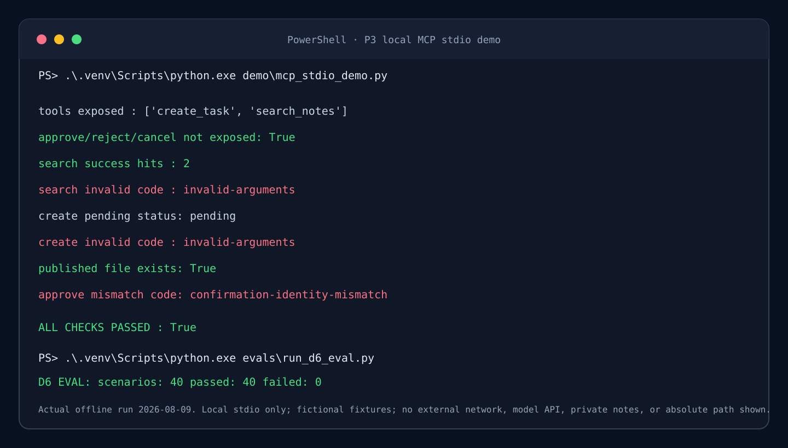

# P3：本地 MCP 笔记检索与受控任务创建服务

系统集成作品。P3 已完成：只读 `search_notes`、受控 `create_task`、Tool 外人工确认、只读 Resource、stdio 与受限本机回环 streamable-HTTP。默认 stdio；HTTP 必须显式开启且只允许 `127.0.0.1`/`::1`，不公开部署、不调模型、不读私人笔记。当前验收：240 项 unittest（231 通过 + 9 默认跳过）、C 评估 11/11、D-6 固定离线评估 40/40、stdio 演示 8/8。

目标：实现一个本地 MCP Server（**C 阶段已完成**），提供只读 `search_notes(keyword)`、受控写 `create_task(title, description)` 与一个只读 Resource。服务只能检索配置的笔记白名单目录；任务写入必须经过人工确认，且不能覆盖既有任务。

## GitHub 展示与演示

- **真实证据**：240 项 `unittest`（231 通过、9 项真实链接专项默认跳过）；C 阶段评估 11/11；D-6 固定离线评估 40/40；真实本地 stdio 演示 8/8。
- **演示入口**：运行 `demo/mcp_stdio_demo.py`，展示 Tool 列表、受控检索、待确认任务、Tool 外批准和失败路径；运行 `evals/run_d6_eval.py` 重放 40 例金标准。
- **面试学习**：MCP 边界、路径安全、`PUBLISHING` 并发状态机、身份文件和 25 个面试问答见 [LLH_Study.md](LLH_Study.md)。
- **配置模板**：使用 [.env.example](.env.example) 了解本地配置；任务根与身份文件必须由受控部署预创建，不能提交真实 `.env` 或 `identity.json`。
- **运行证据图**：下图来自 2026-08-09 的真实本地 stdio 演示与 D-6 离线评估；仅保留脱敏结果，不含任务路径、私人笔记或身份文件。



> 公开说明边界：默认是本地 stdio；可选 HTTP 仅本机回环。真实 symlink/junction、Linux/WSL 实机验证、真实多用户/OS 身份、跨主体审计隔离和公开部署均未完成。

## 当前阶段

- 状态：`completed`（P3 的 Slice A、B1、B2a、C 与 D-1 至 D-6 均已完成并本地提交；当前等待用户决定是否统一 push / 建 PR）。
- 已实现（Slice A）：`src/mcp_notes/` 纯标准库合同与检索逻辑、`evals/fixtures/notes-v1/` 3 份原创虚构笔记、`tests/` stdlib `unittest` 套件（含默认网络阻断底座）。
- 已实现（Slice B1 路径安全索引）：新增 `src/mcp_notes/safe_open.py` —— 基于 Windows 原生句柄（`NtOpenFile` / `NtQueryDirectoryFile`，`OBJ_DONT_REPARSE` + 相对父 HANDLE）拒绝 symlink / junction / reparse point 跟随与 TOCTOU。具体已落实并通过测试（Codex P0/P1 修订）：
  - 组件级校验（§4.6）拒绝空段、`.`、`..`、`\`、`/`、`:`、`< > " | ? *`、控制字符、尾随点 / 空格、保留设备名；`open_file_relative` 先校验 `rel_parts` 为非空列表并对每一级组件校验；`_nt_open` 在相对父 HANDLE 打开时**也自行校验组件**，不依赖调用方。
  - 文件打开（非目录）携带 `FILE_READ_ATTRIBUTES`，打开后查询 `WIN32_FILE_BASIC_INFO` 拒绝 DIRECTORY / REPARSE_POINT / DEVICE，再查询 `WIN32_FILE_STANDARD_INFO` 做容量上限（`> MAX_NOTE_BYTES`(1 MiB) → `content-too-large`）；任一查询失败 → `io-error`。
  - 枚举（`NtQueryDirectoryFile`）缓冲区解析遵循 §4.4 硬边界逐字段断言（新增 `buffer_length` 参数并断言 `0 < Information <= buffer_length`；`NextEntryOffset` 非 0 时须 `>= 固定头长`、`8` 字节对齐、`record_start < record_end <= Information`；`FileName` 区域不得越过 `record_end`；UTF-16LE 解码异常 → `io-error`）；任何越界 / 畸形 / `Information==0` / 非成功状态 / `BUFFER_OVERFLOW` 一律 `io-error`，绝不返回部分枚举结果。
  - 根配置门拒绝 `..` / UNC / 设备前缀 / 正斜杠混用 / 相对路径；`UNICODE_STRING.Length/MaximumLength` 按真实 UTF-16LE 字节数计算并拒绝超过 `USHORT` 上限；`IO_STATUS_BLOCK` 的 `Status` 用 32 位 `c_long`、`Information` 用指针宽度 `c_size_t`（不写死 `c_ulonglong`）。
  - 失败关闭与事务语义（§9）：reparse 条目 → `_walk` 抛 `not-allowed-reparse`（不 `continue` 跳过）→ `build_index` 整体失败 `index-build-failed`；超大文件使本次构建失败并丢弃新索引，绝不静默跳过或发布部分结果；构建整体失败不发布部分索引。
  - R0/T0 真实机器 ABI 冒烟（根打开 + 枚举 + 相对文件打开 + FileBasicInfo + FileStandardInfo + HANDLE→fd 读取 + 关闭一次 + 清理临时目录），失败即 `unsafe-open-unavailable`，绝不回退到字符串路径方案；链接专项测试（T7–T10）默认跳过（即使设置 `P3_ALLOW_FS_LINK_FIXTURES=1` 也仅为未实现门控占位，真实链接夹具尚不可用，不创建/不运行真实 symlink / junction；预期为拒绝/构建失败而非跳过）。
- 已实现（Slice B2a 离线 `create_task` 受控写入核心）：新增 `src/mcp_notes/tasks.py` 与 `src/mcp_notes/safe_task_write.py` —— 纯标准库、离线的受控写核心：`create_task` 严格数据合同（NFKC 归一 + 内含 URL/Shell/路径形态拒绝，`title 1..120` / `description 1..1000`）、sqlite3 持久化（`confirmations`/`idempotency`/`audit` 三表，审计不存正文）、任务文件 no-replace 原子发布（Windows 原生 `NtCreateFile(FILE_CREATE, OBJ_DONT_REPARSE)` 原子无覆盖，任务根/祖先目录经 `open_task_root` 逐级 `NtOpenFile(OBJ_DONT_REPARSE)` 句柄验证，reparse→失败关闭 `task-root-unsafe`，绝不回退字符串路径；冲突不覆盖）。`create_task` 只建待确认意图，不写任务文件；批准在 Tool 外由可信本地上下文（`TrustedContext(subject, correlation_id)`）执行。**当前最终状态机已由 D-4 收紧为 `PENDING → PUBLISHING → APPROVED`；写入失败不盲目回退 `PENDING`，以当前“GitHub 展示与演示”区和 `docs/COMPLETION_AUDIT.md` 为准。**
  - **任务根须预存在**：生产代码不创建任务根或其祖先目录（已移除 `os.makedirs`），只做句柄链原生验证；根不存在 / 非目录 / reparse / 原生不可用 → 失败关闭 `task-root-unsafe`，不写文件。
  - **创建成功后写入失败的处理**：JSON 序列化先于 `NtCreateFile`；文件创建成功后 `WriteFile` / `FlushFileBuffers` 任一失败 → 稳定 `task-write-failed`（不泄露原始异常），文件 HANDLE 只关闭一次，随后对已验证父目录 HANDLE 相对 `NtDeleteFile` 清理（不使用 `os.remove` / `os.replace`）。经 3 项故障注入回归实测：无最终文件、无半成品 / 临时残留，确认记录保持 `PENDING`，移除故障后重放可成功创建。
  - **发布与状态提交顺序**：文件发布成功后再提交 `APPROVED` 状态；发布失败时确认记录保持 `PENDING`。
- 已实现（C 阶段，MCP Server / Resource / Host / Client 真实本地 stdio 接入）：新增 `src/mcp_notes/server.py`（MCP Python SDK v2 `MCPServer`；注册 Tool `search_notes(keyword)` 与 `create_task(title, description)`、只读 Resource `notes://service-info`；`create_task` 仅建 PENDING 意图，其 `TrustedContext` 由服务端派生——`subject` 来自部署配置、`correlation_id` 由服务端对 NFKC 归一后的“标题 + 描述”取 SHA-256 确定性派生（同内容重放天然幂等，见 D-018）；客户端不能直接提供或覆盖 correlation_id，它不是凭证、不授予批准权限，批准仍要求 Tool 外本地 Host、自身受控 subject 与记录匹配；Tool 参数失败经 `SafeMCPServer` 统一收敛为稳定 `invalid-arguments`，不外泄 Pydantic 文本 / 类型细节 / 堆栈 / URL，未知字段不被静默忽略）、`src/mcp_notes/host.py`（`TrustedHostController` 在 Tool 表面之外审批 / 拒绝 / 取消，只用 Host 自身配置 `subject` + 服务端记录的关联 ID 重建可信上下文，复用 B2a 的 `TasksStore`）、`demo/mcp_stdio_demo.py`（真实 stdio 子进程的 8 项成功 + 失败演示全部通过）、`tests/test_mcp_integration.py`（**20 项** stdio 集成测试，父进程与 Server 子进程均默认阻断外部网络，全部通过）、`tests/test_server_entry.py`（**2 项**入口 / 配置测试：生产入口不创建任务根、默认笔记根指向仓库夹具）、`evals/gold/c-phase-v1.json` 与 `evals/run_c_phase_eval.py`（11 例固定离线评估全部通过）。`approve` / `reject` / `cancel` **绝不**作为 Tool 暴露（经 `list_tools` 验证）。（注：本节为 C 阶段历史结果；当前统一基线见 STATUS：196 项 / 23 集成 / 6 入口）
- 已实现（C 阶段依赖锁）：唯一直接生产依赖 `mcp==2.0.0`（MIT），含 29 个传递依赖；项目本地 `.venv`（Python **3.13.14**）占用 **74.6 MiB（78.2 MB）**。安装前经 Codex 批准；`python -m pip check` 无破损、无 `Ignoring invalid distribution` 警告。测试中父进程与 Server 子进程均默认阻断外部网络（仅放行 stdio 与本地回环）。
- 当前没有真实模型调用、真实私人笔记或公开部署；仅运行本地 stdio MCP 进程，全部使用原创虚构离线夹具。网络口径：运行时只用本地 stdio 管道、不发起对外网络连接；测试期的网络阻断由 `NETWORK_ACCESS_BLOCKED_IN_TESTS=1` 开关驱动，是测试约束而非生产能力声明。
- 计划仅使用原创虚构离线笔记夹具；不读取用户私人笔记。

## 历史 Slice A 离线验证记录

本节保留 Slice A～C 的历史验证口径（如 149 项测试），用于追溯开发过程；当前完整验证以本 README 顶部的 240 项测试、D-6 40/40、`docs/COMPLETION_AUDIT.md` 和下列演示区为准。Slice A 仅用 CPython 标准库实现，**无需 `.venv`、无需安装任何依赖**。在任意 Python 3.13/3.14 解释器下即可复跑：

```powershell
Set-Location projects\03-mcp-tool-server
python --version
python -m compileall -q src tests
python -m unittest discover -s tests -v
```

预期：`compileall` 通过；B2a 子集 **53 项**（`tests/test_create_task.py`，全部执行通过，无 skip）；stdlib `unittest` 总计 **149 项**（`discover -s tests`），其中 145 项执行通过、4 项链接专项测试（T7–T10）默认跳过（即使设置 `P3_ALLOW_FS_LINK_FIXTURES=1` 也仅为未实现门控占位，真实链接夹具尚不可用，绝不创建/运行真实 symlink / junction；预期为拒绝/构建失败而非跳过）。Slice A 既有检索/合同/网络阻断测试全部保留并通过；B1 新增句柄级路径安全测试（T0–T9，含原生冒烟、正常布局硬边界、句柄链读取、reparse 致构建失败、失败关闭、畸形缓冲、内容过大、伪造条目路径逃逸、文件属性判定、组件校验等失败回归）；B2a 新增受控写核心测试（12 金标准场景 + 非法参数、无确认不写文件、网络阻断、敏感扫描、字段校验、双绑定、已消费不被过期改写、真实 no-replace 竞态、任务根安全边界、上下文严格校验、confirmation_id 不回显，以及“创建成功后写入失败”3 项故障注入回归——`WriteFile` 失败 / `FlushFileBuffers` 失败 / `approve` 路径写入失败，均为清理成功路径，各自断言返回 `task-write-failed`、任务目录无残留、状态保持 `PENDING` 且重试可成功；另有 4 项收口回归——冲突文件只读回查的 `open_osfhandle` 失败 / `fdopen` 失败 / `read` 失败（各断言返回稳定 `task-write-failed`、不泄露原始异常、确认保持 `PENDING`，且退出 mock 后冲突文件可被立即删除、证明 HANDLE/fd 已释放无遗留锁）与 `NtDeleteFile` 非成功 NTSTATUS（断言返回脱敏稳定 `task-write-failed`、不回显 NTSTATUS/路径、确认保持 `PENDING`、且**不错误断言目录必空**））。C 阶段新增 **20 项** stdio 集成测试（`tests/test_mcp_integration.py`，全部通过；含参数脱敏 4 项、重放幂等 2 项、跨主体 Host 拒绝、子进程网络阻断 2 项）+ **2 项**入口 / 配置测试（`tests/test_server_entry.py`）+ 11 例固定离线评估（`evals/run_c_phase_eval.py`，全部通过）；真实本地 MCP Server/Host/Client 已通过 stdio 子进程运行并产生成功 + 失败证据（见 `demo/mcp_stdio_demo.py`，8 项断言全部通过）。D-018 修复后复跑 `discover -s tests` 总计 **149 项**（145 执行通过 + 4 项链接专项测试默认跳过）。（注：149/20/2 为 C 阶段历史基线；当前统一基线 196 项 / 23 集成 / 6 入口，见 STATUS 与 ARCHITECTURE §7）

## 文档入口

- [需求与验收标准](docs/PRD.md)
- [计划架构与安全数据流](docs/ARCHITECTURE.md)
- [依赖提案（已安装 `mcp==2.0.0`）](docs/DEPENDENCIES.md)
- [固定离线评估方案](docs/EVALUATION_DATA.md)
- [后续安全接力说明](docs/WORKBUDDY_HANDOFF.md)
- [关键取舍](DECISIONS.md)
- [当前状态](STATUS.md)

## 已知限制与后续工作

P3 的 D-1 至 D-6 已完成并本地提交。仍需单独批准并实施：真实 symlink/junction 专项、Linux/WSL 实机验证、真实多用户/OS 凭证绑定、跨主体审计隔离和公开部署。任何后续阶段都不应把笔记正文、模型输出或客户端输入当作路径、命令、URL 或写入授权。
