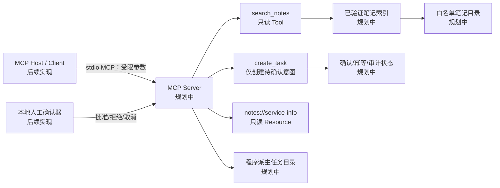
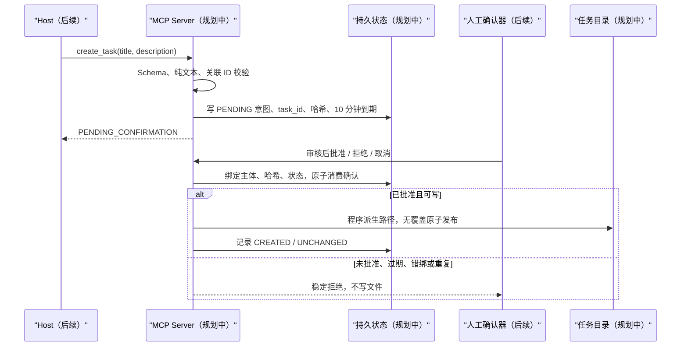

# P3 架构：规划中的本地 MCP 服务

- 版本：v0.1（规划中；Slice A 的 search_notes 纯标准库核心已实现并离线验证）
- 日期：2026-08-01

## 0. 实现状态（Slice A 已完成 / 仍计划）

- **已实现（Slice A，纯标准库、离线、无依赖）**：`search_notes` 的数据合同、参数校验、笔记索引登记（最小普通 `.md` 登记）、确定性离线检索与 stdlib `unittest` 套件（含默认网络阻断底座）。关键词先 NFKC 归一再拒绝路径/URL/Shell 形态；匹配用 NFKC + casefold；excerpt 与 hits 为常量硬上限；非法参数返回稳定 `ArgumentError`；笔记标题按不可信数据转义限长。
- **仍为计划（Slice B 及之后）**：MCP Server 适配层与 Resource `notes://service-info`、stdio transport；`create_task` 待确认意图与人工确认状态机；sqlite3 持久化；以及**路径安全检查**（symlink/junction/reparse point/`..` 越界/TOCTOU 拒绝式检查）。当前 `index.py` 仅为最小文件登记，未施行文件系统防护，不得宣称路径安全已实现。
- 图中组件除已说明的 Slice A 核心外，其余仍为计划边界。

## 1. 组件边界

| 边界 | 责任 | 明确不负责 |
|---|---|---|
| MCP Client / Host（后续） | 通过本地 stdio 调用 Tool、读取 Resource；由可信适配器提供主体与关联 ID | 不授予文件或写入权限；不直接批准任务 |
| MCP Server（后续） | Schema、权限、路径验证、索引、确认状态、幂等、脱敏错误和 MCP 响应 | 不调用模型、不联网、不执行命令 |
| `search_notes` | 只读搜索已验证笔记索引 | 不接受路径/文件名，不修改索引或笔记 |
| `create_task` | 建立冻结写意图并返回待确认状态 | 不直接写任务，不接受确认/主体/路径参数 |
| 人工确认器（后续，本地可信边界） | 展示冻结意图并批准、拒绝或取消一次 | 不由模型、MCP Tool 或笔记文本自动触发 |
| 本地文件系统 | 笔记白名单根、服务状态根、任务根 | 不由客户端指定路径 |

图中全部组件为计划边界；没有已运行 MCP Server、Host、Client 或文件写入。

## 2. 显式数据流

### 2.1 `search_notes`

1. MCP Server 接收仅含 `keyword` 的 JSON 参数。拒绝未知字段、非字符串、空白、过长和禁止语义。
2. Server 不从参数获得目录、文件名、glob、正则或排序表达式。
3. 服务启动/重载时，从配置的逻辑笔记根建立索引：逐段检查祖先、根、子目录和候选文件；拒绝链接、junction/reparse point、越界解析、非普通文件、未允许扩展名和大小超限。
4. 读取时再次安全打开登记对象，确认最终对象身份仍属于已验证根与索引登记项；不满足即失败，不回退普通 `open()`。
5. 对受限 UTF-8 内容进行确定性关键词匹配；正文不执行、不解析为权限、不访问其中 URL。
6. 结果仅包含稳定 `note_id`、标题、截断转义摘录和计数。绝对路径、原始异常、完整正文和敏感模式文本不进入结果或日志。

### 2.2 `create_task`

人工确认器必须显示规范化标题、描述、`task_id`、到期时间与可信主体。人工动作不是 Tool 参数，不由 MCP 消息中的声明身份、笔记内容或模型输出决定。

## 3. 文件系统安全设计

### 3.1 受控根

后续配置只保存三个由部署者设置的绝对根：笔记根、状态根、任务根。它们不是 Tool 参数、Resource 内容或日志字段。启动前分别验证：路径已规范化、存在、目录类型正确、每一段祖先与根均非符号链接和 Windows reparse point，并且根之间不重叠为不安全写入关系。

### 3.2 读取

- 仅索引程序允许的 `.md` 普通文件，生成 `note_id`；Tool 从不接收文件名或相对路径。
- 目录遍历使用不跟随链接的枚举；每个条目检查 `lstat`/Windows 属性。发现任意 symlink、junction 或未知 reparse point 即拒绝该索引批次。
- 打开后再次使用句柄最终路径与文件身份验证其仍属于受控根，防止索引到打开之间替换。Windows 实现必须使用可检查 reparse point 的打开方式和句柄身份；无法实现时安全拒绝。
- 设置单文件、总索引和单次摘录上限；超限不回显正文。

### 3.3 写入

- `task_id` 由服务生成并限定字母、数字、连字符；最终路径仅为 `任务根 / <task_id>.json`。
- 不接受外部目录、文件名、扩展名、相对段、绝对路径、URL 或 Shell 参数。
- 每次写前重新验证任务根和最终父目录没有 symlink/junction/reparse point；最终目标若存在只能比较同一已提交记录后返回 `UNCHANGED`，绝不替换。
- 在同一受控目录写临时普通文件、`fsync`，以 no-replace 原子发布；发布或清理失败只存稳定错误码。目标文件系统不能满足 no-replace 时失败，不降级覆盖。

## 4. 状态与运行时依赖

### 可持久化业务状态（计划）

| 对象 | 最小字段 | 用途 |
|---|---|---|
| 写意图 | `confirmation_id`、`task_id`、可信主体、关联 ID、内容哈希、创建/到期时间、状态 | 确认、过期和身份绑定 |
| 幂等映射 | 可信主体、关联 ID、内容哈希、`confirmation_id`、终态 | 协议重放与冲突检测 |
| 任务记录 | `task_id`、意图哈希、创建时间、发布结果、相对程序派生文件名 | 不可覆盖写入与恢复 |
| 审计事件 | 时间、事件类型、稳定错误码、`task_id`/确认 ID 的安全标识 | 调查安全结果，不存正文 |

计划使用标准库 `sqlite3` 作为本地单进程持久状态，不启动数据库服务。写事务需要原子比较状态、消费确认和登记发布意图；文件发布与状态提交之间的崩溃窗口由重放返回 `UNCHANGED` 或冲突安全失败处理。

### 运行时依赖（不持久化）

- MCP Server/Session、stdio 流、可信 Host 身份适配器、时钟、文件句柄、目录句柄、临时路径、索引内存缓存和 SQLite 连接。
- 配置根的原始绝对路径、环境变量、密钥、Cookie、鉴权头、完整请求/响应、笔记正文、任务正文、原始异常和未脱敏堆栈。

持久化层只保存验证后的最少业务事实和稳定错误码。日志同样不得保存敏感对象；异常向外映射为分类码。

## 5. 未来 MCP Host/Client 集成位置

后续实施先完成纯 Python 核心与离线夹具，再加 MCP SDK 适配层：Server 注册两个 Tool 与固定 Resource；真实本地 Host/Client 通过 stdio 发出已知案例。Host 适配器必须提供服务可验证的本地测试主体和调用关联 ID；普通 Tool 文本字段不能伪造它们。集成演示只使用虚构夹具，覆盖 Resource、成功搜索、拒绝搜索、待确认写、批准一次与重复批准拒绝。

该位置是计划，不能表示已经完成协议互通。
