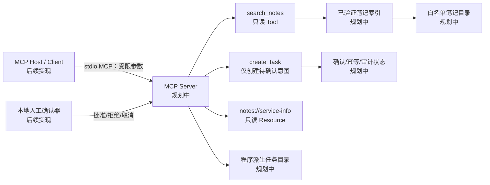
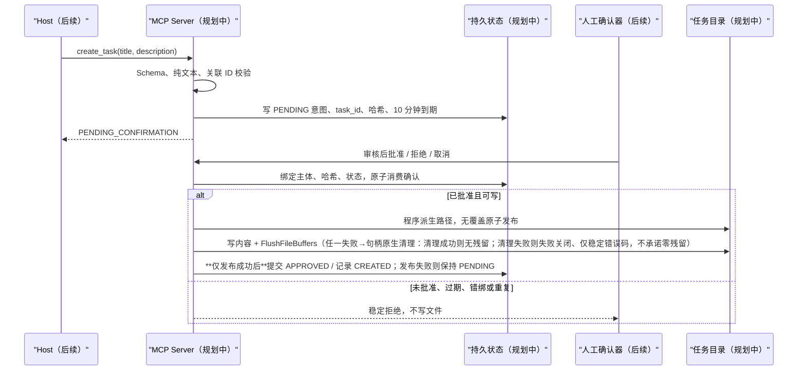

# P3 架构：本地 MCP 服务（离线核心已实现，MCP 适配仍计划）

- 版本：v0.2（Slice A / B1 / B2a 离线核心已实现并离线验证；MCP Server/Resource/Host/Client 适配仍属 B2b，未实现）
- 日期：2026-08-01（B2a 更新 2026-08-02）

## 0. 实现状态

- **已实现（Slice A，纯标准库、离线、无依赖）**：`search_notes` 的数据合同、参数校验、笔记索引登记（最小普通 `.md` 登记）、确定性离线检索与 stdlib `unittest` 套件（含默认网络阻断底座）。关键词先 NFKC 归一再拒绝路径/URL/Shell 形态；匹配用 NFKC + casefold；excerpt 与 hits 为常量硬上限；非法参数返回稳定 `ArgumentError`；笔记标题按不可信数据转义限长。
- **已实现（Slice B1 路径安全索引）**：`safe_open.py` 用 Windows 原生句柄层（非字符串路径遍历）拒绝 symlink / junction / reparse point 跟随与 TOCTOU；路径安全检查已落地，不得再宣称未实现。
- **已实现（Slice B2a 离线 `create_task` 受控写入核心，纯标准库、离线、无依赖）**：`src/mcp_notes/tasks.py` + `src/mcp_notes/safe_task_write.py` 实现 `create_task` 严格数据合同、PENDING/APPROVED/REJECTED/CANCELLED/EXPIRED 人工确认状态机、标准库 `sqlite3` 持久化（`confirmations`/`idempotency`/`audit` 三表，审计不存正文）、任务文件 no-replace 原子发布（Windows 原生 `NtCreateFile(FILE_CREATE, OBJ_DONT_REPARSE)` 原子无覆盖，任务根/祖先目录经 `open_task_root` 逐级 `NtOpenFile(OBJ_DONT_REPARSE)` 句柄验证，reparse→失败关闭 `task-root-unsafe`，绝不回退字符串路径方案），以及 12 类稳定错误码。固定金标准 `evals/gold/tasks-core-v1.json`（12 场景）+ `tests/test_create_task.py`（53 项）。**B2a 不含** MCP SDK/Server/Resource/stdio/Host/Client —— 人工确认动作当前由可信本地上下文 `TrustedContext(subject, correlation_id)` 在 Tool 外驱动。
- **仍为计划（Slice B2b）**：MCP Server 适配层、Resource `notes://service-info`、stdio transport、真实 Host/Client 演示；须复用 B2a 离线核心，不在 Tool 内重建确认/写入逻辑。
- 图中组件除已说明的 Slice A 核心、B1 句柄层、B2a 受控写核心外，其余（MCP Server/Resource/Host/Client 与图示中的“规划中”状态根/任务根运行时）仍为计划边界。

## 1. 组件边界

| 边界 | 责任 | 明确不负责 |
|---|---|---|
| MCP Client / Host（后续） | 通过本地 stdio 调用 Tool、读取 Resource；由可信适配器提供主体与关联 ID | 不授予文件或写入权限；不直接批准任务 |
| MCP Server（后续） | Schema、权限、路径验证、索引、确认状态、幂等、脱敏错误和 MCP 响应 | 不调用模型、不联网、不执行命令 |
| `search_notes` | 只读搜索已验证笔记索引 | 不接受路径/文件名，不修改索引或笔记 |
| `create_task` | 建立冻结写意图并返回待确认状态 | 不直接写任务，不接受确认/主体/路径参数 |
| 人工确认器（后续，本地可信边界） | 展示冻结意图并批准、拒绝或取消一次 | 不由模型、MCP Tool 或笔记文本自动触发 |
| 本地文件系统 | 笔记白名单根、服务状态根、任务根 | 不由客户端指定路径 |

图中全部组件为计划边界；没有已运行 MCP Server、Host、Client 或文件写入。

## 2. 显式数据流

### 2.1 `search_notes`

1. MCP Server 接收仅含 `keyword` 的 JSON 参数。拒绝未知字段、非字符串、空白、过长和禁止语义。
2. Server 不从参数获得目录、文件名、glob、正则或排序表达式。
3. 服务启动/重载时，从配置的逻辑笔记根建立索引：逐段检查祖先、根、子目录和候选文件；拒绝链接、junction/reparse point、越界解析、非普通文件、未允许扩展名和大小超限。
4. 读取时再次安全打开登记对象，确认最终对象身份仍属于已验证根与索引登记项；不满足即失败，不回退普通 `open()`。
5. 对受限 UTF-8 内容进行确定性关键词匹配；正文不执行、不解析为权限、不访问其中 URL。
6. 结果仅包含稳定 `note_id`、标题、截断转义摘录和计数。绝对路径、原始异常、完整正文和敏感模式文本不进入结果或日志。

### 2.2 `create_task`

人工确认器必须显示规范化标题、描述、`task_id`、到期时间与可信主体。人工动作不是 Tool 参数，不由 MCP 消息中的声明身份、笔记内容或模型输出决定。

> **关键不变量（发布与状态提交顺序）**：确认记录仅在任务文件经 no-replace 原子发布**成功**后才提交为 `APPROVED`；若发布失败（写入 / 刷新 / 关闭前异常，或任务根不安全）→ 确认记录保持 `PENDING`，绝不写 `APPROVED`，并在移除故障后可通过重放安全重试并成功创建（**清理成功（`NtDeleteFile` 返回 `STATUS_SUCCESS`）时**；清理失败（非成功 NTSTATUS）则失败关闭，仅返回稳定 `task-write-failed`，不承诺零残留或自动重试成功）。即“**文件发布成功后再提交 APPROVED 状态**”。

> **实现状态（Slice B2a）**：上述 `create_task` 离线数据流**已实现**于 `src/mcp_notes/tasks.py`——`create_task` 只写 PENDING 意图并返回 `task_id`/`confirmation_id`/到期时间（不写任务文件）；`approve`/`reject`/`cancel` 由可信本地上下文 `TrustedContext(subject, correlation_id)` 驱动，**成功批准后先经 no-replace 原子发布 `<task_root>/<task_id>.json`，文件发布成功后才经 sqlite3 持久化将确认记录提交为 `APPROVED`**（即“文件发布成功后再提交 APPROVED”）；发布失败则保持 `PENDING`。图示中标注“规划中”的 MCP Server / 人工确认器 UI / 任务目录运行时仍属 B2b 适配层，本离线核心不依赖它们即可被测试驱动。

> **`TrustedContext` 的实际校验边界**：构造即校验，规则**仅有三条**——`subject` / `correlation_id` 必须是 `str`、长度 `1..256`、不含 C0/DEL 控制字符（`ord < 0x20` 或 `== 0x7F`）；非法值抛受控 `TaskPublishError(invalid-arguments)`，不抛原始 `TypeError`、不泄露异常。**当前未实现“安全字符白名单”**，除控制字符外的任意 Unicode 字符（空格、标点、CJK 等）均被接受。这两个值由本地可信边界注入，不是 Tool 参数，也不由模型 / 客户端控制；若未来需要更严格的字符集约束，须作为单独变更实现白名单并补测试，不得仅在文档中声称。

## 3. 文件系统安全设计

### 3.1 受控根

后续配置只保存三个由部署者设置的绝对根：笔记根、状态根、任务根。它们不是 Tool 参数、Resource 内容或日志字段。启动前分别验证：路径已规范化、存在、目录类型正确、每一段祖先与根均非符号链接和 Windows reparse point，并且根之间不重叠为不安全写入关系。

### 3.2 读取

- 仅索引程序允许的 `.md` 普通文件，生成 `note_id`；Tool 从不接收文件名或相对路径。
- 目录遍历使用不跟随链接的枚举；每个条目检查 `lstat`/Windows 属性。发现任意 symlink、junction 或未知 reparse point 即拒绝该索引批次。
- 打开后再次使用句柄最终路径与文件身份验证其仍属于受控根，防止索引到打开之间替换。Windows 实现必须使用可检查 reparse point 的打开方式和句柄身份；无法实现时安全拒绝。
- 设置单文件、总索引和单次摘录上限；超限不回显正文。

### 3.3 写入

- `task_id` 由服务生成并限定字母、数字、连字符；最终路径仅为 `任务根 / <task_id>.json`。
- 不接受外部目录、文件名、扩展名、相对段、绝对路径、URL 或 Shell 参数。
- 写入前经 `open_task_root` 用句柄逐级 `NtOpenFile(OBJ_DONT_REPARSE)` 验证任务根与每一级祖先目录没有 symlink/junction/reparse point（句柄级打开，非字符串前缀判断，不依赖不可信路径字符串解析）；最终目标若存在只能比较同一已提交记录的内容哈希后返回 `UNCHANGED`，绝不替换。
- 用 Windows 原生 `NtCreateFile(FILE_CREATE, OBJ_DONT_REPARSE)` 原子无覆盖创建任务文件（非 `os.replace`、无“先检查再发布”的竞态窗口）。发布顺序：**先序列化**（序列化失败不创建任何文件，无半成品）→ `open_task_root` 句柄验证根 → `NtCreateFile(FILE_CREATE)` 创建 → 句柄式 `WriteFile` + `FlushFileBuffers`（fsync）。**创建成功后任一写入 / 刷新 / 关闭前异常 → 稳定 `task-write-failed`，不泄露原始异常**；0 字节 / 半成品文件由句柄原生 `NtDeleteFile`（相对已验证父目录 HANDLE，`OBJ_DONT_REPARSE`，**绝不使用字符串路径 `os.remove` / `os.replace` / 任何回退**）清理——**清理成功（`NtDeleteFile` 返回 `STATUS_SUCCESS`）则无残留、无临时文件，移除故障后重放可成功创建；清理失败（非成功 NTSTATUS）则失败关闭，仅返回稳定 `task-write-failed`，不承诺零残留或自动重试成功**；确认记录保持 `PENDING`。
- **任务根由部署配置预存在，生产代码不创建任务根 / 祖先目录**（不调用 `os.makedirs`）：`open_task_root` 仅对预存在的受控目录做逐级 `NtOpenFile(OBJ_DONT_REPARSE)` 句柄验证；根不存在 / 非目录 / reparse / 原生不可用 → 失败关闭 `task-root-unsafe`，绝不写文件、绝不回退字符串路径方案。目标文件系统不能满足 no-replace 时失败，不降级覆盖。

## 4. 状态与运行时依赖

### 可持久化业务状态（Slice B2a 已实现，标准库 `sqlite3`）

> 实现于 `src/mcp_notes/tasks.py`：`confirmations`（写意图 + 状态 + 到期）、`idempotency`（主体/关联ID/内容哈希/终态，用于重放与冲突检测）、`audit`（事件类型、稳定错误码、`task_id`/`confirmation_id` 安全标识，**不存 title/description/正文**）。所有写包在 `try/except sqlite3.Error → rollback`；不做网络、不引入数据库服务。下表为实际落地的字段设计。

| 对象 | 最小字段 | 用途 |
|---|---|---|
| 写意图 | `confirmation_id`、`task_id`、可信主体、关联 ID、内容哈希、创建/到期时间、状态 | 确认、过期和身份绑定 |
| 幂等映射 | 可信主体、关联 ID、内容哈希、`confirmation_id`、终态 | 协议重放与冲突检测 |
| 任务记录 | `task_id`、意图哈希、创建时间、发布结果、相对程序派生文件名 | 不可覆盖写入与恢复 |
| 审计事件 | 时间、事件类型、稳定错误码、`task_id`/确认 ID 的安全标识 | 调查安全结果，不存正文 |

计划使用标准库 `sqlite3` 作为本地单进程持久状态，不启动数据库服务。写事务需要原子比较状态、消费确认和登记发布意图；文件发布与状态提交之间的崩溃窗口由重放返回 `UNCHANGED` 或冲突安全失败处理。

### 运行时依赖（不持久化）

- MCP Server/Session、stdio 流、可信 Host 身份适配器、时钟、文件句柄、目录句柄、临时路径、索引内存缓存和 SQLite 连接。
- 配置根的原始绝对路径、环境变量、密钥、Cookie、鉴权头、完整请求/响应、笔记正文、任务正文、原始异常和未脱敏堆栈。

持久化层只保存验证后的最少业务事实和稳定错误码。日志同样不得保存敏感对象；异常向外映射为分类码。

## 5. 未来 MCP Host/Client 集成位置

后续实施先完成纯 Python 核心与离线夹具，再加 MCP SDK 适配层：Server 注册两个 Tool 与固定 Resource；真实本地 Host/Client 通过 stdio 发出已知案例。Host 适配器必须提供服务可验证的本地测试主体和调用关联 ID；普通 Tool 文本字段不能伪造它们。集成演示只使用虚构夹具，覆盖 Resource、成功搜索、拒绝搜索、待确认写、批准一次与重复批准拒绝。

该位置是计划，不能表示已经完成协议互通。
