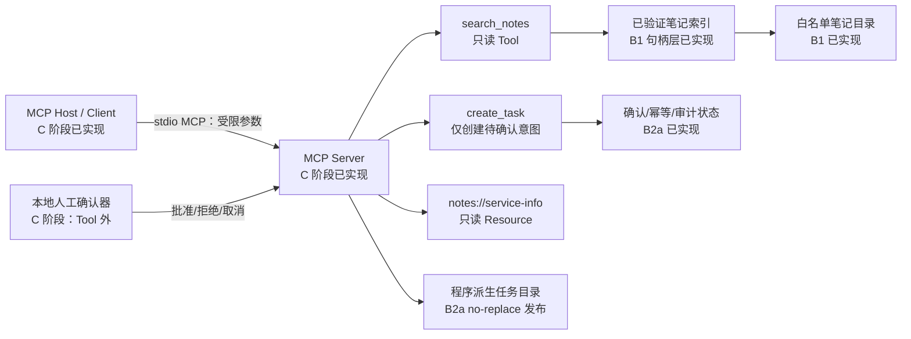
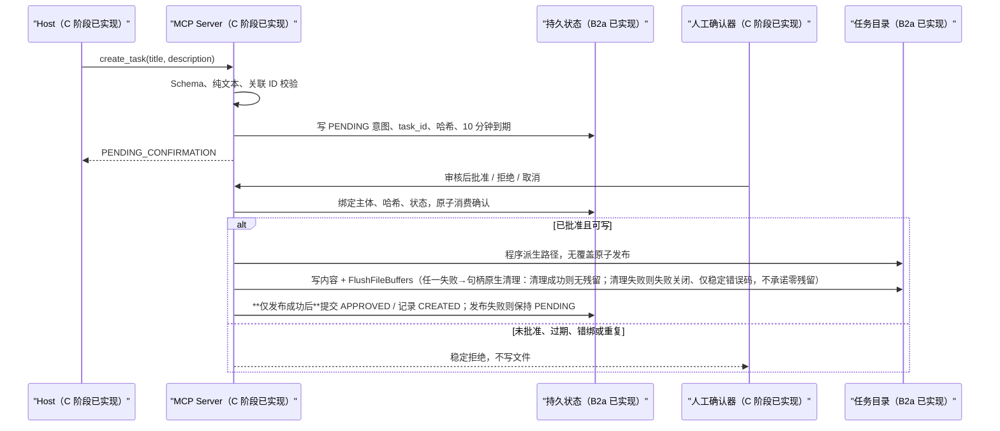

# P3 架构：本地 MCP 服务（离线核心已实现，C 阶段已完成 MCP Server/Resource/Host/Client 真实本地 stdio 接入）

- 版本：v0.3（Slice A / B1 / B2a 离线核心已实现并离线验证；C 阶段已完成 MCP Server/Resource/Host/Client 真实本地 stdio 接入，复用 B2a 离线核心）
- 日期：2026-08-01（B2a 更新 2026-08-02）

## 0. 实现状态

- **已实现（Slice A，纯标准库、离线、无依赖）**：`search_notes` 的数据合同、参数校验、笔记索引登记（最小普通 `.md` 登记）、确定性离线检索与 stdlib `unittest` 套件（含默认网络阻断底座）。关键词先 NFKC 归一再拒绝路径/URL/Shell 形态；匹配用 NFKC + casefold；excerpt 与 hits 为常量硬上限；非法参数返回稳定 `ArgumentError`；笔记标题按不可信数据转义限长。
- **已实现（Slice B1 路径安全索引）**：`safe_open.py` 用 Windows 原生句柄层（非字符串路径遍历）拒绝 symlink / junction / reparse point 跟随与 TOCTOU；路径安全检查已落地，不得再宣称未实现。
- **已实现（Slice B2a 离线 `create_task` 受控写入核心，纯标准库、离线、无依赖）**：`src/mcp_notes/tasks.py` + `src/mcp_notes/safe_task_write.py` 实现 `create_task` 严格数据合同、PENDING/APPROVED/REJECTED/CANCELLED/EXPIRED 人工确认状态机、标准库 `sqlite3` 持久化（`confirmations`/`idempotency`/`audit` 三表，审计不存正文）、任务文件 no-replace 原子发布（Windows 原生 `NtCreateFile(FILE_CREATE, OBJ_DONT_REPARSE)` 原子无覆盖，任务根/祖先目录经 `open_task_root` 逐级 `NtOpenFile(OBJ_DONT_REPARSE)` 句柄验证，reparse→失败关闭 `task-root-unsafe`，绝不回退字符串路径方案），以及 12 类稳定错误码。固定金标准 `evals/gold/tasks-core-v1.json`（12 场景）+ `tests/test_create_task.py`（53 项）。**B2a 不含** MCP SDK/Server/Resource/stdio/Host/Client —— 人工确认动作当前由可信本地上下文 `TrustedContext(subject, correlation_id)` 在 Tool 外驱动。
- **已实现（C 阶段）**：MCP Server 适配层（`src/mcp_notes/server.py`，MCP Python SDK v2 `MCPServer`）、只读 Resource `notes://service-info`、`stdio` transport、真实 Host/Client 演示（`demo/mcp_stdio_demo.py`）均已落地；复用 B2a 离线核心，未在 Tool 内重建确认/写入逻辑；`approve`/`reject`/`cancel` 不在 Tool 表面，由 `TrustedHostController` 在 Tool 外驱动。
- 图中组件除已说明的 Slice A 核心、B1 句柄层、B2a 受控写核心外，MCP Server/Resource/Host/Client 与人工确认器现由 C 阶段实现（非计划边界）；状态根/任务根运行时为程序派生目录，由 `ServerConfig` 配置驱动。

## 1. 组件边界

| 边界 | 责任 | 明确不负责 |
|---|---|---|
| MCP Client / Host（C 阶段已实现） | 通过本地 stdio 调用 Tool、读取 Resource；主体由 Host 自身部署配置绑定，关联 ID 由服务端按内容派生 | 不授予文件或写入权限；不由客户端参数决定批准主体 |
| MCP Server（C 阶段已实现） | Schema、权限、路径验证、索引、确认状态、幂等、脱敏错误和 MCP 响应 | 不调用模型、不执行命令；运行时只用 stdio，不发起对外网络连接 |
| `search_notes` | 只读搜索已验证笔记索引 | 不接受路径/文件名，不修改索引或笔记 |
| `create_task` | 建立冻结写意图并返回待确认状态 | 不直接写任务，不接受确认/主体/关联 ID/路径参数 |
| 人工确认器（C 阶段已实现，本地可信边界） | 展示冻结意图并批准、拒绝或取消一次 | 不由模型、MCP Tool 或笔记文本自动触发 |
| 本地文件系统 | 笔记白名单根、服务状态根、任务根 | 不由客户端指定路径 |

图中 MCP Server / Host / Client 与人工确认器已由 C 阶段实现并验证（见 §6）；状态根/任务根为程序派生目录，由 `ServerConfig` 配置驱动。

## 2. 显式数据流

### 2.1 `search_notes`

1. MCP Server 接收仅含 `keyword` 的 JSON 参数。拒绝未知字段、非字符串、空白、过长和禁止语义。
2. Server 不从参数获得目录、文件名、glob、正则或排序表达式。
3. 服务启动/重载时，从配置的逻辑笔记根建立索引：逐段检查祖先、根、子目录和候选文件；拒绝链接、junction/reparse point、越界解析、非普通文件、未允许扩展名和大小超限。
4. 读取时再次安全打开登记对象，确认最终对象身份仍属于已验证根与索引登记项；不满足即失败，不回退普通 `open()`。
5. 对受限 UTF-8 内容进行确定性关键词匹配；正文不执行、不解析为权限、不访问其中 URL。
6. 结果仅包含稳定 `note_id`、标题、截断转义摘录和计数。绝对路径、原始异常、完整正文和敏感模式文本不进入结果或日志。

### 2.2 `create_task`

人工确认器必须显示规范化标题、描述、`task_id`、到期时间与可信主体。人工动作不是 Tool 参数，不由 MCP 消息中的声明身份、笔记内容或模型输出决定。

> **关键不变量（发布与状态提交顺序）**：确认记录仅在任务文件经 no-replace 原子发布**成功**后才提交为 `APPROVED`；若发布失败（写入 / 刷新 / 关闭前异常，或任务根不安全）→ 确认记录保持 `PENDING`，绝不写 `APPROVED`，并在移除故障后可通过重放安全重试并成功创建（**清理成功（`NtDeleteFile` 返回 `STATUS_SUCCESS`）时**；清理失败（非成功 NTSTATUS）则失败关闭，仅返回稳定 `task-write-failed`，不承诺零残留或自动重试成功）。即“**文件发布成功后再提交 APPROVED 状态**”。

> **实现状态（Slice B2a）**：上述 `create_task` 离线数据流**已实现**于 `src/mcp_notes/tasks.py`——`create_task` 只写 PENDING 意图并返回 `task_id`/`confirmation_id`/到期时间（不写任务文件）；`approve`/`reject`/`cancel` 由可信本地上下文 `TrustedContext(subject, correlation_id)` 驱动，**成功批准后先经 no-replace 原子发布 `<task_root>/<task_id>.json`，文件发布成功后才经 sqlite3 持久化将确认记录提交为 `APPROVED`**（即“文件发布成功后再提交 APPROVED”）；发布失败则保持 `PENDING`。图示中 MCP Server / 人工确认器现已由 C 阶段实现（`src/mcp_notes/server.py` + `host.py`），本离线核心不依赖它们即可被测试驱动；C 阶段关键不变量：`TrustedContext` 由服务端派生（`subject` 来自部署配置、`correlation_id` 由服务端对 NFKC 归一后的 `title\x1fdescription` 取 SHA-256 派生，使同内容重放天然幂等），`approve`/`reject`/`cancel` 不在 Tool 表面且由 Host 自身配置 `subject` 重建上下文（见 §6）。

> **`TrustedContext` 的实际校验边界（Slice B2a/C 阶段原状，已由 D-1 收紧）**：C 阶段构造即校验，规则仅有三条——`subject`/`correlation_id` 必须是 `str`、长度 `1..256`、不含 C0/DEL 控制字符；**该宽松校验已由 D-1 取代**——`subject` 须匹配精确白名单 `^[A-Za-z0-9][A-Za-z0-9._-]{0,127}$`、`correlation_id` 须为服务端派生的 `^[0-9a-f]{64}$`，缺失/非法在配置启动失败关闭（见 DECISIONS D-020）。**唯一身份来源与信任边界已由 D-3 收口，且实现已随作品集仓库 `main` 分支公开（未另建 PR）**（见 `docs/D-3-design.md` **v3**、DECISIONS **D-027**；D-025(v1) 与 D-026(v2) 均已 superseded，属历史引用，勿按其实施）：`subject` 从不作为 Tool 参数/模型文本/MCP 消息字段，由本地可信部署边界注入。这两个值不是 Tool 参数，也不由模型 / 客户端控制。

## 3. 文件系统安全设计

### 3.1 受控根

配置（`ServerConfig`）只保存三个由部署者设置的绝对根：笔记根、状态根、任务根。它们不是 Tool 参数、Resource 内容或日志字段。启动前分别验证：路径已规范化、存在、目录类型正确、每一段祖先与根均非符号链接和 Windows reparse point，并且根之间不重叠为不安全写入关系。

### 3.2 读取

- 仅索引程序允许的 `.md` 普通文件，生成 `note_id`；Tool 从不接收文件名或相对路径。
- 目录遍历使用不跟随链接的枚举；每个条目检查 `lstat`/Windows 属性。发现任意 symlink、junction 或未知 reparse point 即拒绝该索引批次。
- 打开后再次使用句柄最终路径与文件身份验证其仍属于受控根，防止索引到打开之间替换。Windows 实现必须使用可检查 reparse point 的打开方式和句柄身份；无法实现时安全拒绝。
- 设置单文件、总索引和单次摘录上限；超限不回显正文。

### 3.3 写入

- `task_id` 由服务生成并限定字母、数字、连字符；最终路径仅为 `任务根 / <task_id>.json`。
- 不接受外部目录、文件名、扩展名、相对段、绝对路径、URL 或 Shell 参数。
- 写入前经 `open_task_root` 用句柄逐级 `NtOpenFile(OBJ_DONT_REPARSE)` 验证任务根与每一级祖先目录没有 symlink/junction/reparse point（句柄级打开，非字符串前缀判断，不依赖不可信路径字符串解析）；最终目标若存在只能比较同一已提交记录的内容哈希后返回 `UNCHANGED`，绝不替换。
- 用 Windows 原生 `NtCreateFile(FILE_CREATE, OBJ_DONT_REPARSE)` 原子无覆盖创建任务文件（非 `os.replace`、无“先检查再发布”的竞态窗口）。发布顺序：**先序列化**（序列化失败不创建任何文件，无半成品）→ `open_task_root` 句柄验证根 → `NtCreateFile(FILE_CREATE)` 创建 → 句柄式 `WriteFile` + `FlushFileBuffers`（fsync）。**创建成功后任一写入 / 刷新 / 关闭前异常 → 稳定 `task-write-failed`，不泄露原始异常**；0 字节 / 半成品文件由句柄原生 `NtDeleteFile`（相对已验证父目录 HANDLE，`OBJ_DONT_REPARSE`，**绝不使用字符串路径 `os.remove` / `os.replace` / 任何回退**）清理——**清理成功（`NtDeleteFile` 返回 `STATUS_SUCCESS`）则无残留、无临时文件，移除故障后重放可成功创建；清理失败（非成功 NTSTATUS）则失败关闭，仅返回稳定 `task-write-failed`，不承诺零残留或自动重试成功**；确认记录保持 `PENDING`。
- **任务根由部署配置预存在，生产代码不创建任务根 / 祖先目录**（不调用 `os.makedirs`）：`open_task_root` 仅对预存在的受控目录做逐级 `NtOpenFile(OBJ_DONT_REPARSE)` 句柄验证；根不存在 / 非目录 / reparse / 原生不可用 → 失败关闭 `task-root-unsafe`，绝不写文件、绝不回退字符串路径方案。目标文件系统不能满足 no-replace 时失败，不降级覆盖。

## 4. 状态与运行时依赖

### 可持久化业务状态（Slice B2a 已实现，标准库 `sqlite3`）

> 实现于 `src/mcp_notes/tasks.py`：`confirmations`（写意图 + 状态 + 到期）、`idempotency`（主体/关联ID/内容哈希/终态，用于重放与冲突检测）、`audit`（事件类型、稳定错误码、`task_id`/`confirmation_id` 安全标识，**不存 title/description/正文**）。所有写包在 `try/except sqlite3.Error → rollback`；不做网络、不引入数据库服务。下表为实际落地的字段设计。

| 对象 | 最小字段 | 用途 |
|---|---|---|
| 写意图 | `confirmation_id`、`task_id`、可信主体、关联 ID、内容哈希、创建/到期时间、状态 | 确认、过期和身份绑定 |
| 幂等映射 | 可信主体、关联 ID、内容哈希、`confirmation_id`、终态 | 协议重放与冲突检测 |
| 任务记录 | `task_id`、意图哈希、创建时间、发布结果、相对程序派生文件名 | 不可覆盖写入与恢复 |
| 审计事件 | 时间、事件类型、稳定错误码、`task_id`/确认 ID 的安全标识 | 调查安全结果，不存正文 |

计划使用标准库 `sqlite3` 作为本地单进程持久状态，不启动数据库服务。写事务需要原子比较状态、消费确认和登记发布意图；文件发布与状态提交之间的崩溃窗口由重放返回 `UNCHANGED` 或冲突安全失败处理。

### 运行时依赖（不持久化）

- MCP Server/Session、stdio 流、可信 Host 身份适配器、时钟、文件句柄、目录句柄、临时路径、索引内存缓存和 SQLite 连接。
- 配置根的原始绝对路径、环境变量、密钥、Cookie、鉴权头、完整请求/响应、笔记正文、任务正文、原始异常和未脱敏堆栈。

持久化层只保存验证后的最少业务事实和稳定错误码。日志同样不得保存敏感对象；异常向外映射为分类码。

## 5. MCP Host/Client 集成（C 阶段已实现）

C 阶段已在纯 Python 离线核心之上完成 MCP SDK 适配层：Server（`src/mcp_notes/server.py`，MCP Python SDK v2 `MCPServer`）注册两个 Tool（`search_notes` / `create_task`）与固定只读 Resource（`notes://service-info`），经 `stdio` transport 由真实本地 Host/Client 拉起；`TrustedHostController`（`src/mcp_notes/host.py`）在 Tool 表面之外驱动 `approve`/`reject`/`cancel`，复用 B2a 的 `TasksStore`。Host 的批准主体只来自 Host 自身部署配置（`self._subject`），关联 ID 只来自服务端持久化记录（`TasksStore.lookup_correlation_id`）；调用方不能传入主体或关联 ID，普通 Tool 文本字段也不能伪造它们。集成演示（`demo/mcp_stdio_demo.py`）与集成测试（`tests/test_mcp_integration.py`）只使用虚构夹具，覆盖 Resource、成功搜索、拒绝搜索、待确认写、批准一次、重复批准拒绝、跨主体 Host 拒绝、参数脱敏与重放幂等。

该位置已实现并验证（见 §6），不再是计划；不接真实模型、不读私人笔记、不公开部署。网络口径：**运行时只用本地 stdio 管道，不发起对外网络连接**；测试中父进程与 Server 子进程均通过 `NETWORK_ACCESS_BLOCKED_IN_TESTS=1` 默认阻断外部网络（放行 stdio 与本地回环），这是测试开关而非生产能力声明。

## 6. C 阶段实现要点（MCP Server / Resource / Host / Client）

- **Server（v2 `MCPServer`）**：`build_server(config)` 构建，注册 `search_notes(keyword)`（只读已验证索引）、`create_task(title, description)`（仅建 PENDING 意图）、`notes://service-info`（静态 JSON）。Tool 绝不接收路径 / 文件名 / 确认 ID / 主体 ID / 任务 ID / 目标目录（D-002/D-004 不变）。
- **`TrustedContext` 服务端派生**：`create_task` 内 `TrustedContext(subject, correlation_id)` 的 `subject` 来自部署配置；`correlation_id` 由服务端对 NFKC 归一后的 `title\x1fdescription` 取 SHA-256（`_derive_correlation_id`）确定性派生；客户端不能直接提供或覆盖 correlation_id，它不是凭证、不授予批准权限，批准仍要求 Tool 外本地 Host、自身受控 subject 与记录匹配。内容派生使得**同一规范化请求重放得到同一 `task_id`/`confirmation_id`/同一待确认记录**，不同内容得到彼此独立的意图。
- **Tool 参数失败必须脱敏且稳定**：`SafeMCPServer`（`MCPServer` 子类）覆写 `_handle_call_tool`，在进入 SDK Pydantic 校验前做形状守卫（非 dict / 未知字段 / 缺必填 / 非字符串 → 稳定 `{"status":"error","error_code":"invalid-arguments"}`），并把任何非 `MCPError` 异常统一收敛为同一响应；输出中不含 Pydantic 文本、`errors.pydantic.dev` 链接、`ValidationError`、类型细节或堆栈，未知字段不被静默忽略。
- **确认动作不在 Tool 表面且绑定 Host 自身主体**：`approve`/`reject`/`cancel` 不注册为 MCP Tool（`list_tools` 验证只暴露 `search_notes` 与 `create_task`），由 `TrustedHostController` 在 Tool 外驱动；控制器用 `self._subject`（Host 自身部署配置）+ `TasksStore.lookup_correlation_id(confirmation_id)` 重建 `TrustedContext`，**不再存在 `approve_with_context` 之类可传入任意主体的入口**；记录主体与 Host 主体不一致时由 `tasks.py` 返回 `confirmation-identity-mismatch` 并不写任何文件。
- **生产入口不创建任务根**：`server.main()` 只 `os.makedirs` 状态库所在目录，**绝不创建 `config.task_root`**（D-015：任务根必须由部署配置预先存在）；测试/演示中的临时目录创建只作为夹具存在，不在生产代码路径上。
- **sqlite 跨线程修复（安全核心零改动）**：MCP v2 在 worker 线程跑 Tool handler，`create_task` handler 内每次重新实例化 `TasksStore` 并 `finally: store.close()`；`safe_task_write.py`/`tasks.py` 的发布 / no-replace / 幂等 / 审计逻辑未改。
- **测试期网络阻断（父进程 + Server 子进程）**：`src/mcp_notes/_network_block.py` 是唯一实现（回环感知），由 `tests/_network_block.py` 与 `server.main()` 共用；`main()` 仅在 `NETWORK_ACCESS_BLOCKED_IN_TESTS=1` 时安装，阻断 DNS 与外部 socket/HTTP，放行 stdio 管道与本地回环。这是**测试开关**，不改变生产网络能力，也不引入 HTTP transport。
- **测试与评估**：`tests/test_mcp_integration.py`（**20 项** stdio 集成测试，父进程与 Server 子进程均默认阻断外部网络）+ `tests/test_server_entry.py`（**2 项**入口 / 配置测试）+ `evals/gold/c-phase-v1.json` / `evals/run_c_phase_eval.py`（11 例固定离线评估）+ `demo/mcp_stdio_demo.py`（8 项成功 + 失败演示），全部通过；`discover -s tests` 总计 **149 项**（145 执行通过 + 4 链接测试默认跳过）。（注：本节为 **C 阶段历史结果**；当前统一基线见 §7：226 项（217 执行通过 + 9 链接测试默认跳过）/ 23 项 stdio 集成 / 6 项入口配置。）
- **known-limitations-for-D**：`SafeMCPServer` 依赖 SDK v2 `_handle_call_tool` 的内部结构，SDK 升级需回归；`correlation_id` 内容派生使其在同主体下可预测（取舍见 DECISIONS D-018）；`TrustedContext` 已由 D-1 实现精确字符白名单（`subject` 须匹配 `^[A-Za-z0-9][A-Za-z0-9._-]{0,127}$`、`correlation_id` 须服务端派生 `^[0-9a-f]{64}$`）；**唯一身份来源与信任边界已由 D-3 收口，且实现已随作品集仓库 `main` 分支公开（未另建 PR）**（见 `docs/D-3-design.md` v3、DECISIONS **D-027**；v1/D-025 与 v2/D-026 均已被取代）；（历史记录：D-3 实现落地前 `subject` 由 `MCP_NOTES_SUBJECT` 提供，现行实现使用受控 `identity.json`、fd/HANDLE 链安全读取与 `RuntimeIdentity` 注入）网络阻断是测试期 monkeypatch 而非 OS 级沙箱；单进程、非并发、非多用户；仅 Windows 原生 no-replace 发布经实机验证，跨平台一致性待 D-2 已补 Windows 可验证部分（真实链接夹具仍 blocked-until-approved）；真实 Host 支持面与公开部署不在本次范围。

## 7. D 阶段计划（规划，待逐片实现）

D 阶段在 §6 末 known-limitations-for-D 范围内做加固与补齐，不扩大 C 阶段安全合同（§3/§4）。
- D-5 已实现：唯一直接生产依赖 `mcp==2.0.0` 不变；默认 stdio，显式 streamable-HTTP 复用 SDK 已含 `starlette`/`uvicorn`/`httpx2`，只允许 `127.0.0.1`/`::1` 与固定 `/mcp`，拒绝 SSE 与公网监听。
- 切片顺序：**D-1 身份格式与安全字符白名单 → D-2 跨平台原子发布一致性 → D-3 唯一身份来源与信任边界 → D-4 并发/多用户隔离 → D-5 真实 Host 支持面/传输扩展 → D-6 补齐评估基线**；公开部署不在默认范围。
- D-2 收紧：POSIX 方案必须 fd 链式 `openat(dir_fd, O_NOFOLLOW)` + `fstat` 逐级验证，**禁止字符串路径回退、禁止用 `realpath` 做安全判断**（realpath 非路径安全权威，`O_NOFOLLOW` 只覆盖单次打开组件）；平台缺能力稳定 `task-root-unsafe` 失败关闭；真实 symlink/junction 夹具须用户单独批准，未批准不创建不运行。
- D-3 收紧（设计见 `docs/D-3-design.md` **v3**、DECISIONS **D-027**；v1/D-025 与 v2/D-026 均已被取代，勿按其实施）：**唯一值来源 = 受控身份根下部署预置的 `identity.json`，该文件必须存在**；`MCP_NOTES_SUBJECT` **永不产生最终 subject、不作后备**，仅在文件安全读取成功后作可选相等性断言（不等即失败关闭），可验证不变量为「删除该 env 后加载结果逐字节相同」。身份文件必须经 **fd/HANDLE 链**安全读取（Windows `OBJ_DONT_REPARSE` HANDLE 链、POSIX `O_NOFOLLOW`+`fstat` fd 链，均**只读复用 D-2 原语、零修改 `safe_task_write*.py`**），类型断言对**已打开 fd** 做 `fstat` 以防检查后替换，**禁字符串路径读取与 `realpath` 安全判断，能力缺失即失败关闭**；限长 4096 B、schema 严格（`version==1` / `subject` / `subject_kind`，未知键拒绝）。身份注入采用 **M1「每进程一次加载」模型（v3 修正，支持现有分离进程 stdio 演示）**：`load_runtime_identity()` 是无全局状态、可重入的纯加载函数，**每个参与进程在自身 bootstrap 处调用一次** → 不可变 `RuntimeIdentity` → 注入本进程的 `ServerConfig` 或 `TrustedHostController`，**生产构造器不再接受裸 `str` subject**；单进程内嵌（tests/evals）是 M1 的特例。**一致性论据不是「同一对象实例」**（v2 的说法已废止，与 spawn 子进程的演示冲突），而是「**同一受控身份文件 + 确定性加载算法 ⇒ 同一 subject 值**」的部署级保证；**跨进程「启动期一致性断言」明确不支持**（无通道、零网络不引入 IPC、两次读取间文件可变），两进程被指向不同文件或文件在两次加载间变动时，唯一保护是请求期 `confirmation-identity-mismatch`。`RuntimeIdentity` 的私有构造哨兵**仅为受信代码内的类型/API 防呆，不是安全边界**——真正边界是客户端/模型无法在服务进程内执行代码、无法写受控身份根、无法控制受控启动器环境。subject 从不作为 Tool 参数/模型文本/MCP 消息字段；全部身份失败复用 `invalid-arguments`（不新增 `identity-unavailable`），其前提**收敛为当前可验收的两类入口**——`server.main()`（已实现稳定码退出，`server.py:376-378`）与受控启动器（demo/evals/测试夹具）；`host.py` 是库类、无 `main()`，本轮不新增，**不声称**「Host 所有启动入口已满足稳定码要求」（另有前瞻性条款约束未来入口）。部署前提：受控身份根客户端不可写、`MCP_NOTES_IDENTITY_FILE` 只来自受控启动器；**客户端可控整个进程环境的部署不在 D-3 信任模型内**。
- D-4 已实现：并发正确性靠**`BEGIN IMMEDIATE` 写预约 + 条件 UPDATE + 持久化 PUBLISHING + D-2 no-replace**，而非连接池/WAL/Python 锁。`PENDING`→`PUBLISHING`（发布前独立提交）→`APPROVED`；`reject`/`cancel`/`expiry` 读到 `PUBLISHING` 只能受控恢复或失败关闭，绝不写负向终态。真实多用户与跨 subject 审计隔离仍 blocked-until-approved。
- D-6 收紧：**40 例为总数且包含既有 11 例 C 基线**（即新增 29 例），保留并重跑既有 11 例结果，不改写。
- D-6 已实现：`evals/run_d6_eval.py` 复跑原 C 阶段 11 例并执行新增 29 例，读取冻结 cases/gold，输出结果基线 40/40；只用虚构夹具和临时目录。
- 每片小步实现、独立测试、固定评估、交 Codex 复核；详细验收标准与统一验证闸门见 PRD §11。
- 统一验证闸门（每片必保留并复跑当前统一基线）：`unittest` **240 项**（231 执行通过 + 9 链接测试默认跳过）、**23 项** stdio 集成、**6 项**入口/配置、C 评估 11/11、D-6 评估 40/40、stdio 演示 8/8、`pip check`、`git diff --check` 全绿；任何切片不得降低基线计数。（注：149 项 / 20 集成 / 2 入口为 **历史 C 阶段基线**，D-1 后升 164、D-2 后升 196、D-3 后升 226、D-4 后升 235、D-6 后升 240，见 §6。）
- 不变约束：不把模型输出/笔记正文/客户端输入当作路径·命令·URL·写入授权；`task_root` 仍须部署配置预存在，生产代码不创建任务根；`correlation_id` 仍由服务端确定性派生，客户端不能直接提供或覆盖，`approve`/`reject`/`cancel` 仍绝不暴露为 Tool。
